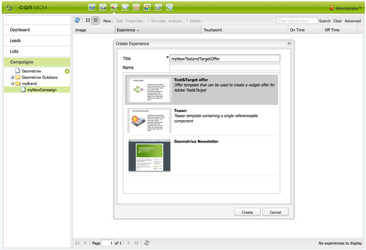

# Target オファー {#target-offers}

## Test&amp;Target オファーエクスペリエンスの作成 {#creating-a-test-target-offer-experience}

1. 新しいキャンペーンを左側のパネルで選択するか、右側のパネルでダブルクリックします。
1. 次のアイコンを使用してリスト表示を選択します。

   

1. 「**新規...**」をクリックします。
1. 「**タイトル**」、「**名前**」および作成するエクスペリエンスのタイプ（この例では、「Test&amp;Target のオファー」）を指定できます。

   

1. 「**作成**」をクリックします。

   >[!NOTE]
   >
   >Test&amp;Target のエクスペリエンスは、この時点で MCM のリストに表示されていません。「キャンペーン」の下の **web サイト**&#x200B;コンソールからアクセスできます。

## Adobe Target との統合 {#integrating-with-adobe-target}

詳しくは、[Adobe](/help/sites-administering/target.md) [Target](/help/sites-administering/target.md) との統合を参照してください。
