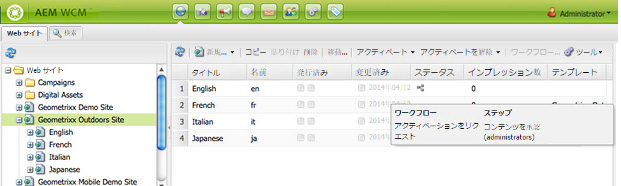

# ページへのワークフローの適用{#applying-workflows-to-pages}

ワークフローを適用する際には、次の情報を指定します。

* 適用されるワークフロー。

  （AEM 管理者によって割り当てられた、アクセス権限がある）任意のワークフローを適用できます。
* オプション：

  * ワークフローを開始した理由に関するコメント。
  * ユーザーのインボックス内のワークフローインスタンスの特定に役立つタイトル。

>[!NOTE]
>
>AEM 管理者は、[その他のいくつかの方法](/help/sites-administering/workflows-starting.md)を使用してワークフローを開始できます。

## ワークフローの適用 {#applying-workflows}

ワークフローは、web サイトコンソールから、またはページの編集中にサイドキックから開始できます。

**Web サイト**&#x200B;コンソールの「**ステータス**」列は、ワークフローがページに適用されているかどうかを示します。

### Web サイトコンソールからのワークフローの開始 {#starting-a-workflow-from-the-websites-console}

1. Web サイトコンソールを開きます。 （[http://localhost:4502/siteadmin](http://localhost:4502/siteadmin)）
1. Web サイトツリーで、ワークフローを適用するページの親を選択します。
1. ページリストでページを選択し、「ワークフロー」をクリックします。
1. ワークフローを開始ダイアログで、適用するワークフローを選択します。 必要に応じて、コメントとタイトルを入力します。 次に、「開始」をクリックします。

### サイドキックを使用したワークフローの開始 {#starting-a-workflow-using-sidekick}

1. Web サイトコンソールを開きます。
1. 必要なページを開きます。
1. サイドキックから「ワークフロー」タブを選択します。
1. **ワークフロー**&#x200B;ダイアログを展開して「**ワークフロー**」を選択し、必要に応じて、**ワークフロータイトル**&#x200B;と&#x200B;**コメント**&#x200B;を入力します。

   

1. 「**ワークフローを開始**」をクリックして、設定したプロパティと現在のページをペイロードとして新しいワークフローインスタンスを開始します。 これで、ワークフローが実行状態になります。
