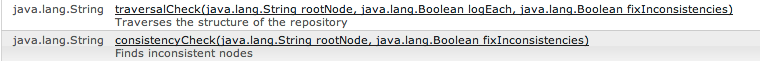

# 整合性チェックとトラバーサルチェック{#consistency-and-traversal-checks}

アップグレード時に、ワークスペースの不整合が原因で問題が発生する可能性があります。 テストのアップグレードを実行して問題が発生しているかどうかを確認するか、予防策として整合性チェックを実行できます。

テストアップグレードを実行した結果、ワークスペースの不整合によって失敗した場合は、crx-quickstart/logs/crx/error.log に次のようなエントリが表示されます。

```xml
*ERROR* TarPersistenceManager: No bundle found for uuid 'deadbeef-cafe-babe-cafe-babecafebabe'
 ...
*ERROR* RepositoryImpl: Failed to initialize workspace 'crx.default'
javax.jcr.RepositoryException: Error indexing workspace: Error indexing workspace: Error indexing workspace
...
```

## 整合性チェックの実行 {#perform-a-consistency-check}

整合性チェックを実行するには、JMX Mbean **com.adobe.granite （Repository）**&#x200B;の管理ページに移動します。 AEMのメイン画面から、次の場所に移動します。

**ツール／web コンソール／メイン（メニューバー）／JMX／com.adobe.granite（リポジトリ）**

デフォルトのインストールでは、このページは次の場所にあります。**[|表示|](http://localhost:4502/system/console/jmx/com.adobe.granite%3Atype%3DRepository)**

「**操作**」セクションには、**`traversalCheck`** と **`consistencyCheck`** という 2 つのメソッドがあります。 チェックを実行するには、この操作をクリックして必要なパラメーターを入力します。


