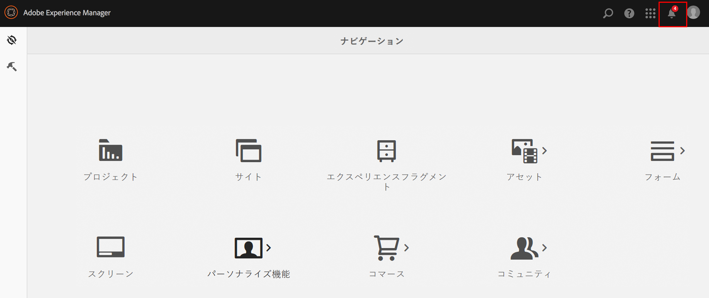
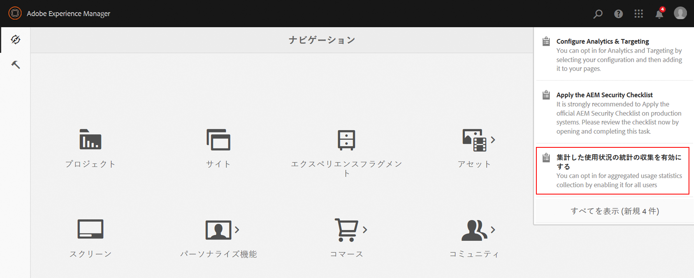
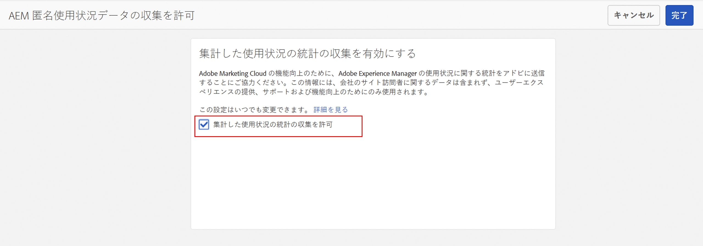
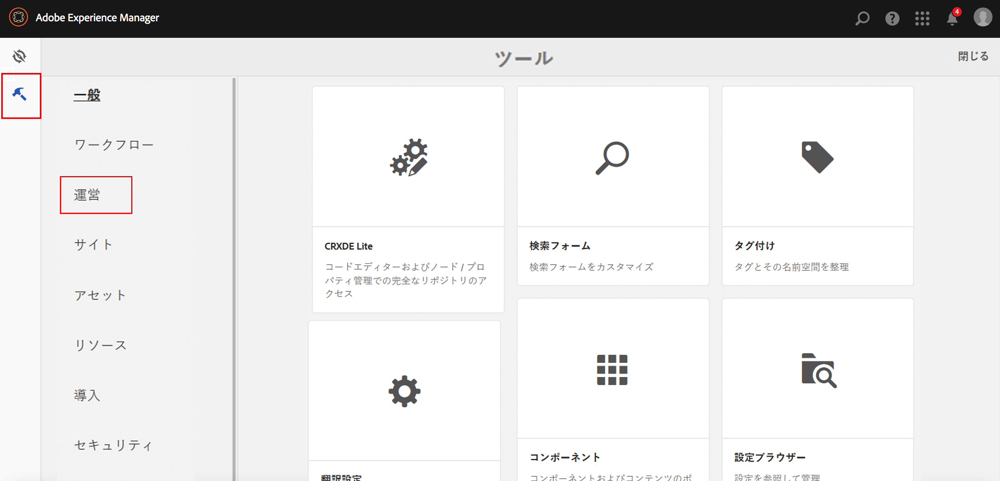
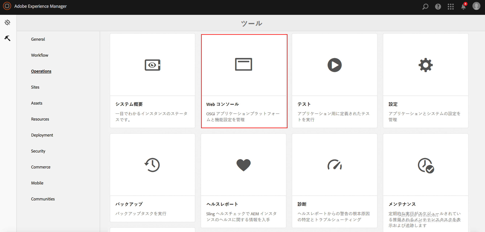
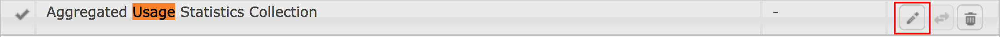
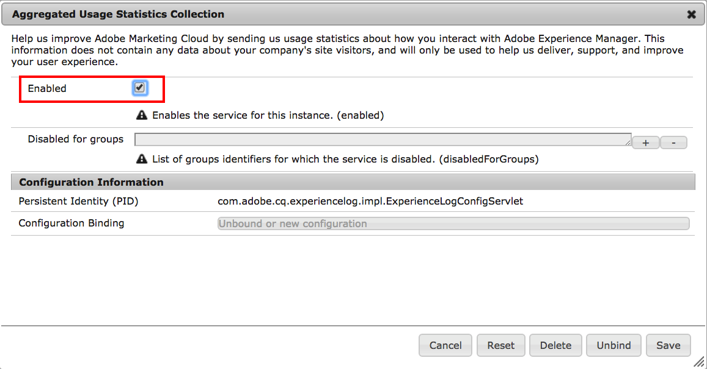

# 集計された使用統計の収集をオプトイン{#opting-into-aggregated-usage-statistics-collection}

## はじめに {#introduction}

Adobe Experience Manager（AEM）とのやり取りに関する Adobe 統計を送信することで、Adobe Experience Cloud の改善に役立てることができます。 この情報には会社のサイト訪問者に関するデータは含まれておらず、アドビがユーザーエクスペリエンスを提供、サポート、改善するためにのみ使用されます。

使用状況の統計の収集をオプトインするには、タッチ UI または web コンソールを使用します。

>[!NOTE]
>
>GDPR や CCPA など、様々なデータ保護およびプライバシー規制があります。 AEM Sites では、データ保護やプライバシーコンプライアンスに関する義務をお客様が果たすのを支援する準備が整っています。 このページでは、集計された使用状況の統計情報コレクションをオプトイン（またはオプトアウト）する手順について説明します。
>
>詳しくは、[アドビのプライバシーセンター](https://www.adobe.com/jp/privacy.html)も参照してください。

>[!NOTE]
>
>[Web コンソール ] （/help/sites-deploying/opt-in-aggregated-usage-statistics.md#opt-in-by-using-the-web-consoleを使用するか、AEM オプトイン画面でオプトインオプションを選択しないことで、いつでもオプトアウトできます。

## タッチ UIを使用したオプトイン {#opt-in-by-using-the-touch-ui}

AEMを初めて起動する場合は、次のようにタッチ UIを使用してオプトインできます。

1. AEM ナビゲーション画面で、**インボックス**（ベル）アイコンをクリックします。

   

1. ドロップダウンリストで、**集計された使用状況の統計コレクションを有効にする**&#x200B;をクリックします。

   

1. オプトイン画面で、「**[!UICONTROL 集計された使用統計の収集を許可する]**」オプションをクリックします。

   

1. 「**完了**」をクリックします。

## Web コンソールを使用したオプトイン {#opt-in-by-using-the-web-console}

Web コンソールを使用して、次のようにオプトイン（またはオプトアウト）できます。

1. AEM ナビゲーション画面で、**ツール**／**操作** の順にクリックします。

   

1. 操作ウィンドウで「**Web コンソール**」をクリックします。

   

1. **集計された使用状況の統計コレクション**&#x200B;を検索します。
1. **編集**&#x200B;アイコンをクリックします。

   

1. 「**Enabled**」チェックボックスをオンにします。 または、使用状況の統計の収集をオプトアウトする場合は、このチェックボックスをオフにします。

   

1. 「**保存**」をクリックします。
