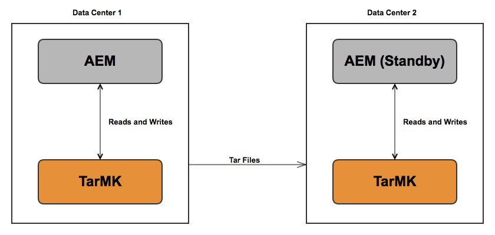

# 推奨されるデプロイメント{#recommended-deployments}

>[!NOTE]
>
>このページでは、AEM の推奨されるトポロジについて説明します。クラスター化機能およびその設定方法について詳しくは、[Apache Sling Discovery API のドキュメント](https://sling.apache.org/documentation/bundles/discovery-api-and-impl.html)を参照してください。

AEM 6.2 以降、MicroKernels は永続性マネージャーとして機能します。ニーズに合わせた MicroKernel の選択は、インスタンスの目的と検討しているデプロイメントタイプによって決まります。

以下の例は、最も一般的な AEM 設定で推奨される使用法を示しています。

## デプロイメントのシナリオ {#deployment-scenarios}

### 単一の TarMK インスタンス {#single-tarmk-instance}

このシナリオでは、単一の TarMK インスタンスを 1 台のサーバーで実行します。

**これは、オーサーインスタンスのデフォルトのデプロイメントです。**

メリット：

* シンプル
* メンテナンスが容易
* 良好なパフォーマンス

デメリット：

* サーバーの能力の制限を超えたスケーラビリティはない
* フェイルオーバー機能はない

### TarMK コールドスタンバイ {#tarmk-cold-standby}

単一の TarMK インスタンスが、プライマリインスタンスとして機能します。プライマリのリポジトリは、スタンバイフェイルオーバーシステムにレプリケーションされます。

また、リポジトリ全体が常にフェイルオーバーサーバーにレプリケーションされるので、コールドスタンバイメカニズムをバックアップとして使用することもできます。フェイルオーバーサーバーは、コールドスタンバイモードで実行されます。これは、インスタンスの HttpReceiver のみ実行していることを意味します。

メリット：

* シンプル
* 優れた保守性
* パフォーマンス
* フェイルオーバー

デメリット：

* サーバーの能力の制限を超えたスケーラビリティはない
* 1 台のサーバーがほとんどの時間アイドル状態
* フェイルオーバーは自動ではない（外部で検出されるまで、フェイルオーバーシステムはリクエストの提供を開始できない）

>[!NOTE]
>
>TarMK コールドスタンバイを使用した AEM の設定方法について詳しくは、[この](/help/sites-deploying/tarmk-cold-standby.md)記事を参照してください。

>[!NOTE]
>
>この TarMK の例のコールドスタンバイデプロイメントでは、フェイルオーバーサーバーに定期的にレプリケートされるので、プライマリインスタンスとスタンバイインスタンスの両方が別々にライセンスされている必要があります。ライセンスについて詳しくは、[アドビの一般ライセンス条件](https://www.adobe.com/jp/legal/terms/enterprise-licensing.html)を参照してください。

### TarMK ファーム {#tarmk-farm}

複数の Oak インスタンスを、それぞれ単一の TarMK インスタンスと共に実行します。TarMK リポジトリは独立しており、同期が維持されている必要があります。

オーサーサーバーが各ファームメンバーに同じコンテンツを公開することによって、リポジトリの同期が維持されます。詳しくは、[レプリケーション](/help/sites-deploying/replication.md)を参照してください。

**これは、パブリッシュ環境のデフォルトのデプロイメントです。**

メリット：

* パフォーマンス
* 読み取りアクセスに対するスケーラビリティ
* フェイルオーバー

### 単一のデータセンターで高可用性を確保するための MongoMK フェイルオーバーを備えた Oak クラスター {#oak-cluster-with-mongomk-failover-for-high-availability-in-a-single-datacenter}

このアプローチでは、複数の Oak インスタンスが単一のデータセンター内の MongoDB レプリカセットにアクセスでき、事実上、AEM オーサー環境のアクティブ-アクティブ構成のクラスターになります。MongoDB のレプリカセットを使用すると、ハードウェアまたはネットワークに障害が発生した場合に高可用性と冗長性を確保することができます。

メリット：

* 新しい AEM オーサーインスタンスで水平方向に拡張可能
* データレイヤーの高可用性、冗長性、自動フェイルオーバー

デメリット：

* シナリオによっては TarMK 使用時よりパフォーマンスが低下する可能性あり

### 複数のデータセンターにわたる MongoMK フェイルオーバーを備えた Oak クラスター {#oak-cluster-with-mongomk-failover-across-multiple-datacenters}

このアプローチでは、複数の Oak インスタンスが複数のデータセンターをまたいで MongoDB レプリカセットにアクセスできるので、事実上、AEM オーサー環境のアクティブ/アクティブ構成のクラスターになります。MongoDB のレプリケーションでは、複数のデータセンターを使用する場合にも同じ高可用性と冗長性を提供しますが、さらにデータセンターの停止に対処する機能も追加されました。

メリット：

* 新しい AEM オーサーインスタンスで水平方向に拡張可能
* データレイヤーの高可用性、冗長性、自動フェイルオーバー（データセンターが停止した場合も含む）

>[!NOTE]
>
>上の図では、データセンター 2 の AEM サーバーとデータセンター 1 の MongoDB プライマリノードとのネットワーク遅延が、[Adobe Experience Manager と MongoDB - チェックリスト](/help/sites-deploying/aem-with-mongodb.md#checklists)に記載されている要件よりも大きいと推測して、AEM サーバー 3 と AEM サーバー 4 のステータスが非アクティブになっています。例えば、可用性ゾーンの使用などにより、最大遅延が要件に反しない場合は、データセンター 2 の AEM サーバーもアクティブになることができ、結果として、複数のデータセンターにまたがるアクティブ-アクティブ構成の AEM クラスターとなります。

>[!NOTE]
>
>この節で説明した MongoDB アーキテクチャの概念について詳しくは、[MongoDB の レプリケーションに関するドキュメント](https://docs.mongodb.org/manual/replication/)を参照してください。

## MicroKernel：どちらを使用すべきか {#microkernels-which-one-to-use}

利用可能な 2 つの MicroKernel 間での選択に際して考慮する必要がある基本ルールは、TarMK はパフォーマンスのために設計されているのに対して、MongoMK はスケーラビリティのために使用されるということです。

要件に最適なタイプのデプロイメントを確立するために、以降に示す意思決定のフローチャートを使用できます。

アドビでは、すべてのデプロイメントのシナリオ（AEM のオーサーインスタンスとパブリッシュインスタンスの両方）で顧客が使用するデフォルトの永続性テクノロジーとして、TarMK を強くお勧めします。ただし、次に示す事例を除きます。

### オーサーインスタンスで TarMK ではなく AEM MongoMK を例外的に選択する場合 {#exceptions-for-choosing-aem-mongomk-over-tarmk-on-author-instances}

TarMK よりも MongoMK 永続性バックエンドを選択する主な理由は、インスタンスを水平方向にスケールできることです。つまり、常に 2 つ以上のアクティブなオーサーインスタンスが動作しており、MongoDB が永続性ストレージシステムとして使用されます。複数のオーサーインスタンスを実行する必要があるのは、通常、1 台のサーバーの CPU とメモリの処理能力では、同時に実行されるすべてのオーサリングアクティビティをサポートできないからです。

新しいサイトの運用開始後の正確な同時実行モデルを予測するのはほぼ不可能です。そのため、アドビでは、MongoMK と 2 つ以上のオーサーアクティブノードを使用するかどうかを評価する際に次の条件を考慮することをお勧めします。

1. 1 日に接続する名前付きユーザー数（数千人以上）
1. 同時ユーザー数（数百人以上）
1. 1 日あたりのアセット収集のボリューム（数十万件以上）
1. 1 日あたりのページ編集のボリューム（数十万件以上）（Multi Site Manager やニュースフィードの収集などによる自動化された更新を含む）
1. 1 日あたりの検索のボリューム（数万件以上）

>[!NOTE]
>
>[Tough Day](/help/sites-developing/tough-day.md) を使用すると、デプロイ済みのハードウェア設定のコンテキストにおける顧客のアプリケーションのパフォーマンスを評価できます。

通常、MongoDB を使用した最小限のデプロイメントには次のトポロジが含まれます。

* 1 つのプライマリノードと 2 つのセカンダリノードで構成された MongoDB レプリカセット。各 MongoDB インスタンスは、各ノード間の遅延が 15 ミリ秒未満の可用性ゾーンで実行されます。
* リーダーノードとリーダー以外のノードを 1 つずつ含む（どちらのノードも常にアクティブです）オーサーインスタンスのクラスター。各オーサーインスタンスは、MongoDB のプライマリインスタンスとセカンダリインスタンスが実行されているそれぞれのデータセンターで実行されます。

また、アセットまたはバイナリが MongoDB 内に格納されないように、共有ファイルシステムまたは Amazon S3 にデータストアを設定することを強くお勧めします。これにより、デプロイメント内で最適なパフォーマンスを確保できます。

2 つ以上のオーサーインスタンスのクラスターを含む MongoDB レプリカセットをデプロイするその他のメリットの 1 つとして、オーサーインスタンス、MongoDB レプリカまたはデータセンター全体で障害が発生した場合に、最小限のダウンタイムで自動的にリカバリできる点が挙げられます。そうは言っても、TarMK ではなく MongoMK を選択するのは、単にリカバリ要件だけが理由ではないはずです（制御されたフェイルオーバーメカニズムを備えた最小限のダウンタイムを実現するソリューションは TarMK でも提供されます）。

デプロイメントの最初の 18 か月間に前述の条件を満たすことができないと思われる場合は、最初に TarMK を使用して AEM をデプロイし、後から（前述の条件を適用する際に）設定を再評価して、TarMK をそのまま使用するか、MongoMK に移行するかを最終的に判断することをお勧めします。

### パブリッシュインスタンスに TarMK ではなく AEM MongoMK を選択する例外的な場合 {#exceptions-for-choosing-aem-mongomk-over-tarmk-on-publish-instances}

パブリッシュインスタンス用に MongoMK をデプロイすることはお勧めしません。ほとんどの場合、デプロイメントのパブリッシュ層は、TarMK を実行する、完全に独立したパブリッシュインスタンスのファームとしてデプロイされます。このパブリッシュインスタンスの同期は、オーサーインスタンスからコンテンツをレプリケーションすることで維持されます。この「何も共有しない」アーキテクチャは、パブリッシュインスタンスに適しており、パブリッシュ層のデプロイメントを水平方向に直線的に拡張できます。また、ファームのトポロジによっても、アップデートやアップグレードをパブリッシュインスタンスに周期的に適用するというメリットがもたらされるので、パブリッシュ層に対する変更の際にダウンタイムが発生しません。

### MongoMK を使用して AEM をデプロイする際の前提条件とレコメンデーション {#prerequisites-and-recommendations-when-deploying-aem-with-mongomk}

AEM 用の MongoMK デプロイメントを検討する場合、一連の前提条件とレコメンデーションがあります。

**MongoDB デプロイメントの必須の前提条件：**

1. AEM を熟知したアドビのコンサルタントまたは MongoDB のアーキテクトの支援のもとで、MongoDB デプロイメントのアーキテクチャとサイジングをプロジェクトの実装に含める必要があります。
1. 既存の、または新しい MongoDB 環境を適切に維持および保守できるように、MongoDB の専門知識をパートナーまたはカスタマーチーム内で共有しておく必要があります。
1. 商用バージョンまたはオープンソースバージョンの MongoDB（AEM ではどちらもサポート可）のデプロイを選択できますが、MongoDB のメンテナンスとサポートの契約を MongoDB Inc. から直接購入する必要があります。
1. AEM と MongoDB の全体的なアーキテクチャおよびインフラストラクチャについて明確に定義し、アドビの AEM アーキテクトによる検証を済ませておく必要があります。
1. MongoDB を含む AEM デプロイメントのサポートモデルについて確認します。

**MongoDB デプロイメントの重要なレコメンデーション：**

* [MongoDB for Adobe Experience Manager デプロイメントレビュー](https://www.mongodb.com/lp/contact/mongodb-adobe-experience-manager)を参照してください。
* [MongoDB の操作チェックリスト](https://docs.mongodb.org/manual/administration/production-checklist/)を確認してください。
* [MongoDB の認定クラスにオンライン](https://university.mongodb.com/)で参加できます。

>[!NOTE]
>
>前述のガイドライン、前提条件および推奨事項に関するその他のご質問については、[アドビのカスタマーケア](https://helpx.adobe.com/jp/marketing-cloud/contact-support.html)までお問い合わせください。
