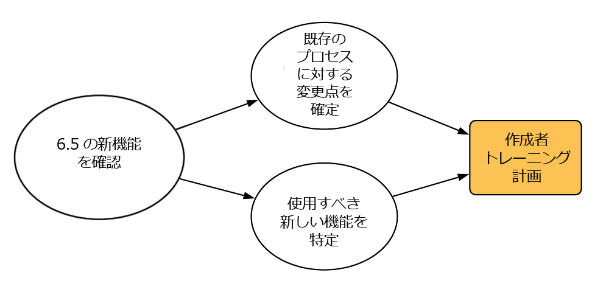
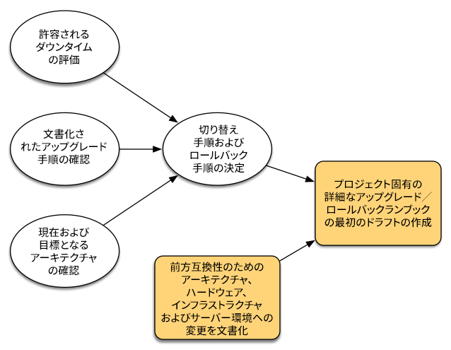
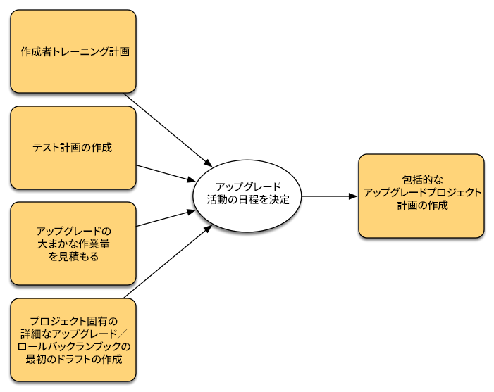
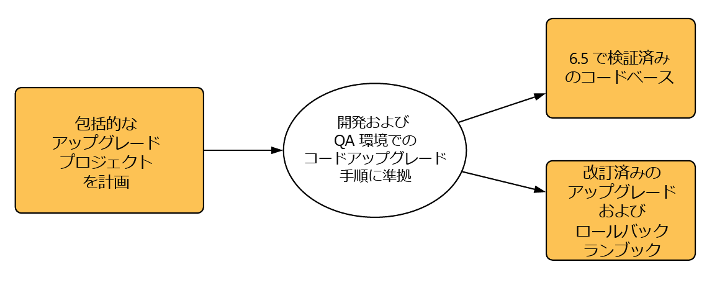
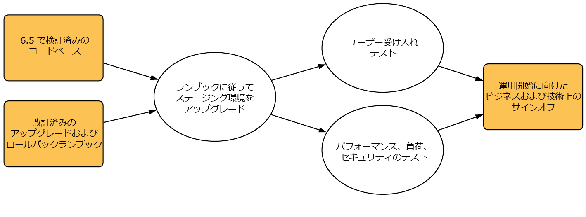

# アップグレードの計画 {#planning-your-upgrade}

## AEM アップグレードの概要 {#aem-upgrade-overview}

AEM は、何百万人ものユーザーにサービスを提供するような、影響の大きいデプロイメントで使用されることがよくあります。 通常、インスタンスにカスタムアプリケーションがデプロイされ、さらに複雑な構成になっています。 このようなデプロイメントをアップグレードするときには、入念な計画が必要です。

このガイドでは、アップグレードの計画で明確な目標、フェーズ、成果物を定める際に役立つ情報を示します。 全体的なアップグレードの実行とガイドラインに焦点を当てます。 実際のアップグレード手順の概要を示しますが、入手可能な技術リソースを参照するよう指示する場合もあります。 このドキュメントで参照されている入手可能な技術リソースを併せて使用してください。

AEM アップグレードプロセスでは、プランニング、分析および実行のフェーズと、各フェーズで定義される主要成果物を慎重に扱う必要があります。

>[!NOTE]
>
>AEM 6.5 LTSへのアップグレードは、サポートされているすべての6.5 サービスパックで利用できます。

サポート対象のオペレーティングシステム、Java™ ランタイム、httpd および Dispatcher バージョンを実行していることを確認することが重要です。 詳しくは、「[AEM 6.5 LTSの技術要件](/help/sites-deploying/technical-requirements.md)」を参照してください。 これらのコンポーネントのアップグレードは、アップグレードプランで考慮する必要があり、AEMをアップグレードする前に実行する必要があります。

<!--
Alexandru: drafting for now

## Upgrade Scope and Requirements {#upgrade-scope-requirements}

Below you will find a list of areas that are impacted in a typical AEM Upgrade project:

<table>
 <tbody>
  <tr>
   <td><strong>Component</strong></td>
   <td><strong>Impact</strong></td>
   <td><strong>Description</strong></td>
  </tr>
  <tr>
   <td>Operating System</td>
   <td>Uncertain, but subtle effects</td>
   <td>At the time of the AEM upgrade, it may be time to upgrade the operating system as well and this might have some impact.</td>
  </tr>
  <tr>
   <td>Java&trade; Runtime</td>
   <td>Moderate Impact</td>
   <td>AEM 6.3 requires JRE 1.7.x (64 bit) or later. JRE 1.8 is the only version currently supported by Oracle.</td>
  </tr>
  <tr>
   <td>Hardware</td>
   <td>Moderate Impact</td>
   <td>Online Revision Cleanup requires free  disk space equal to 25% of the repository's size and 15% free heap space  to complete successfully. You may need to upgrade your hardware to  ensure sufficient resources for Online Revision Cleanup to fully  run. Also, if upgrading from a version prior to AEM 6, there  may be additional storage requirements.</td>
  </tr>
  <tr>
   <td>Content Repository (CRX or Oak)</td>
   <td>High Impact</td>
   <td>Starting from version 6.1, AEM does not support CRX2, so a migration to  Oak (CRX3) is required if upgrading from an older version. AEM 6.3 has  implemented a new Segment Node Store that also requires a migration. The  crx2oak tool is used for this purpose.</td>
  </tr>
  <tr>
   <td>AEM Components/Content</td>
   <td>Moderate Impact</td>
   <td><code>/libs</code> and <code>/apps</code> are easily handled through the upgrade, but <code>/etc</code> usually requires some manual reapplication of customizations.</td>
  </tr>
  <tr>
   <td>AEM Services</td>
   <td>Low Impact</td>
   <td>Most AEM core services are tested for upgrade. This is an area of low impact.</td>
  </tr>
  <tr>
   <td>Custom Application Services</td>
   <td>Low to High Impact</td>
   <td>Depending on the application and customization, there may be  dependencies on JVM, operating system versions, and some indexing related  changes, as indexes are not generated automatically in Oak.</td>
  </tr>
  <tr>
   <td>Custom Application Content</td>
   <td>Low to High Impact</td>
   <td>Content that will not be handled through the upgrade can be backed up  before the upgrade takes place and then moved back into the repository.  Most content can be handled through the migration tool.</td>
  </tr>
 </tbody>
</table>

It is important to ensure that you are running a supported operating system, Java&trade; runtime, httpd, and Dispatcher version. For more information, see the [AEM 6.5 Technical Requirements page](/help/sites-deploying/technical-requirements.md). Upgrading these components must be accounted for in your project plan and should take place before upgrading AEM.
-->

## アップグレードフェーズ {#upgrade-phases}

AEM のアップグレードの計画と実行には、多くの作業が必要になります。 このプロセスに含まれる様々な作業を明確にするために、計画と実行に伴う作業を個別のフェーズに分割しました。 以下のセクションでは、各フェーズでは、アップグレードの今後のフェーズで頻繁に使用される成果物が作成されます。

<!--
Alexandru:drafting for now

### Planning for Author Training {#planning-for-author-training}

With any new release, there are potential changes to the UI and user workflows that may be introduced. Also, new releases introduce new features that may be beneficial for the business to use. Adobe recommends reviewing the functional changes that have been introduced and organizing a plan to train your users on using them effectively.

New features in AEM 6.5 can be found in [the AEM section of adobe.com](/help/release-notes/release-notes.md). Make sure to note any changes to UIs or product features that are commonly used in your organization. As you look through the new features, also take note of any that can be of value to your organization. After looking through what has changed in AEM 6.5, develop a training plan for your authors. This could involve using freely available resources like the help feature videos or formal training offered through [Adobe Digital Learning Services](https://learning.adobe.com/).
-->

### テスト計画の作成 {#creating-a-test-plan}

顧客の AEM の実装はそれぞれ固有のものであり、ビジネス要件に合うようにカスタマイズされています。 そのため、システムに対して行われたすべてのカスタマイズを特定し、それらがテスト計画に含まれるようにすることが重要です。

すべてのアプリケーションとカスタムコードが引き続き想定どおりに動作することを確認するには、本番環境を正確に複製し、アップグレード後にその環境でテストを実行する必要があります。 すべてのカスタマイズを元に戻し、パフォーマンス、負荷およびセキュリティのテストを実行します。 テスト計画を立てるときは、日々の運用で使用されている標準の UI およびワークフローに加えて、システムに対して行われたすべてのカスタマイズを対象にします。 これには、カスタム OSGI サービスとサーブレット、Adobe Experience Cloud への統合、AEM コネクタによるサードパーティとの統合、サードパーティとのカスタム統合、カスタムコンポーネントとテンプレート、AEM でのカスタム UI オーバーレイ、およびカスタムワークフローが含まれる場合があります。 さらに、カスタムクエリは、アップグレード後もインデックスが効果的に動作し続けていることを確認するために、引き続きテストする必要があります。

### アップグレードの複雑性の評価 {#assessing-upgrade-complexity}

アドビの顧客が AEM 環境に適用するカスタマイズの量および性質は様々なので、あらかじめ時間をかけて、アップグレードで予期される全体的な作業量を判断することが重要です。 [AEM Analyzer for AEM 6.5 LTS](/help/sites-deploying/aem-analyzer.md)は、アップグレードの複雑さを評価するのに役立ちます。

AEM 6.5 LTS](/help/sites-deploying/pattern-detector.md)用[AEM Analyerを使用すると、ほとんどの場合、アップグレード時に想定される内容を正確に見積もることができます。 ただし、互換性のない変更がある複雑なカスタマイズとデプロイメントの場合は、[ インプレースアップグレードの実行](/help/sites-deploying/in-place-upgrade.md)の手順に従って、開発インスタンスをAEM 6.5 LTSにアップグレードできます。 完了したら、この環境で全体的なスモークテストを実行します。 この演習の目的は、テストケースインベントリを完全に完成させ、正式な欠陥インベントリを作成することではなく、AEM 6.5 LTS互換のコードをアップグレードするために必要な作業量を大まかに見積もることです。 [AEM Analyzer](/help/sites-deploying/aem-analyzer.md)と前のセクションで決定されたアーキテクチャの変更を組み合わせると、アップグレードを計画するためにプロジェクト管理チームに概算を提供できます。

### アップグレードおよびロールバックのランブックの作成 {#building-the-upgrade-and-rollback-runbook}

アドビは AEM インスタンスをアップグレードするためのプロセスを文書化していますが、それぞれの顧客のネットワークレイアウト、デプロイメントアーキテクチャおよびカスタマイズに合わせて、このアプローチの調整が必要になります。 このため、Adobeでは、提供されているすべてのドキュメントを確認し、それを使用して、環境で実行する特定のアップグレードとロールバック手順の概要を記載した、アップグレード固有のRunbookを確認することをお勧めします。

<!--
Alexandru:drafting for now

-->

アップグレードおよびロールバック手順については[アップグレード手順](/help/sites-deploying/upgrade-procedure.md)で、アップグレードを適用するためのステップごとの手順については[インプレースアップグレードの実行](/help/sites-deploying/in-place-upgrade.md)で説明しています。 これらの手順を確認し、システムアーキテクチャ、カスタマイズおよびダウンタイム許容度とともに考慮して、アップグレード時に実行する適切な切り替え手順およびロールバック手順を決定する必要があります。 カスタマイズしたランブックのドラフト作成時には、アーキテクチャまたはサーバーサイズの変更を含める必要があります。

### アップグレードプランの開発 {#developing-an-upgrade-plan}

前の演習の出力を使用して、テストまたは開発の取り組みに必要な予定のタイムラインをカバーするアップグレード計画を作成し、実際のアップグレード実行を行うことができます。

<!--
Alexandru: drafting for now

-->

包括的なプロジェクト計画には、以下が含まれています。

* 開発計画およびテスト計画の確定
* 開発環境および QA 環境のアップグレード
* AEM 6.5 LTSのカスタムコードベースの更新
* QA テストおよび修正サイクル
* ステージング環境のアップグレード
* 統合、パフォーマンスおよび負荷テスト
* 環境認定
* 実稼動

### 開発および QA の実行 {#performing-development-and-qa}

Adobeでは、[ コードとカスタマイズ ](/help/sites-deploying/upgrading-code-and-customizations.md)をAEM 6.5 LTSと互換性を持たせるためのアップグレード手順を提供しています。 この反復プロセスが実行されると、必要に応じてRunbookに変更を加える必要があります。

<!--
Alexandru: drafting for now

-->

通常、開発とテストのプロセスは繰り返されます。 アップグレードプロセスの調整が必要な問題が見つかった場合は、それをカスタムアップグレードランブックに追加してください。 テストと修正を何回か繰り返すと、コードベースは完全に検証され、ステージング環境へのデプロイメントの準備が整います。

### 最終テスト {#final-testing}

アドビでは、コードベースが組織の QA チームによって認定された後に、最後のテストを実施することをお勧めします。 このテストには、ステージング環境でのランブックの検証と、それに続くユーザー受け入れ、パフォーマンスおよびセキュリティのテストが含まれます。

<!--
Alexandru: drafting for now

-->

この手順は、ランブックの手順を実稼動に近い環境で検証できる唯一の機会なので重要です。 環境がアップグレードされたら、エンドユーザーがログインし、日常業務でシステムを使用する際のアクティビティを一通り行う時間を設けることが重要です。 このような領域で実稼動の前に問題を見つけて修正することは、損害が大きくなる実稼働での停止を防ぐために役立ちます。

### アップグレードの実行 {#performing-the-upgrade}

すべての関係者から最終承認を受けたら、定義されたランブック手順に基づいて実行します。 アップグレードおよびロールバックの手順は[アップグレード手順](/help/sites-deploying/upgrade-procedure.md)で、インストール手順は[インプレースアップグレードの実行](/help/sites-deploying/in-place-upgrade.md)を参照してください。

アップグレード手順では、環境を検証するためのいくつかの手順が提供されています。 これらの手順には、アップグレードログの調査やすべての OSGi バンドルが正しく起動することの確認のような基本的なチェックが含まれていますが、ビジネスプロセスに基づいて独自のテストケースを検証することもお勧めします。 また、AEM のオンラインリビジョンクリーンアップおよび関連する定期的な作業のスケジュールをチェックして、それらが処理の少ない時間帯に実行されることを確認することもお勧めします。 これらの定期的な作業は、AEM の長期的なパフォーマンスにとって重要です。
