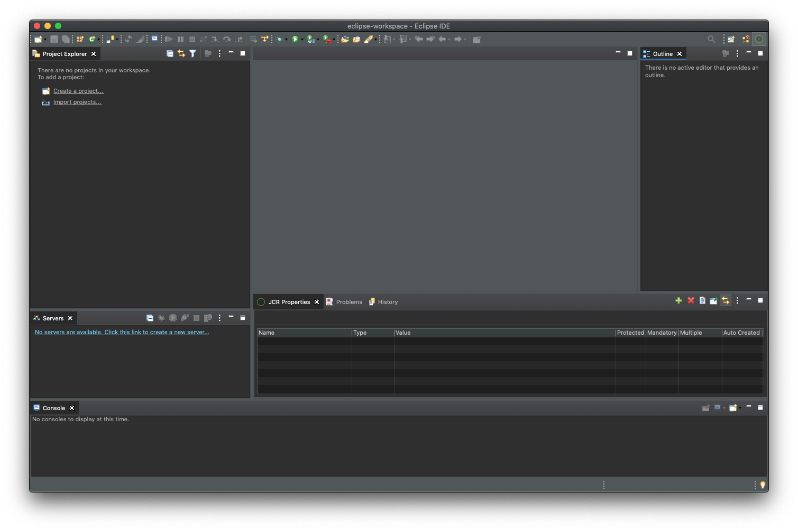
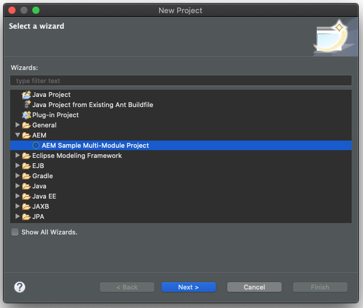
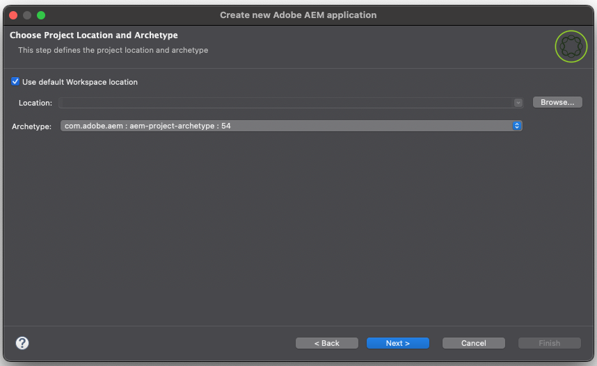
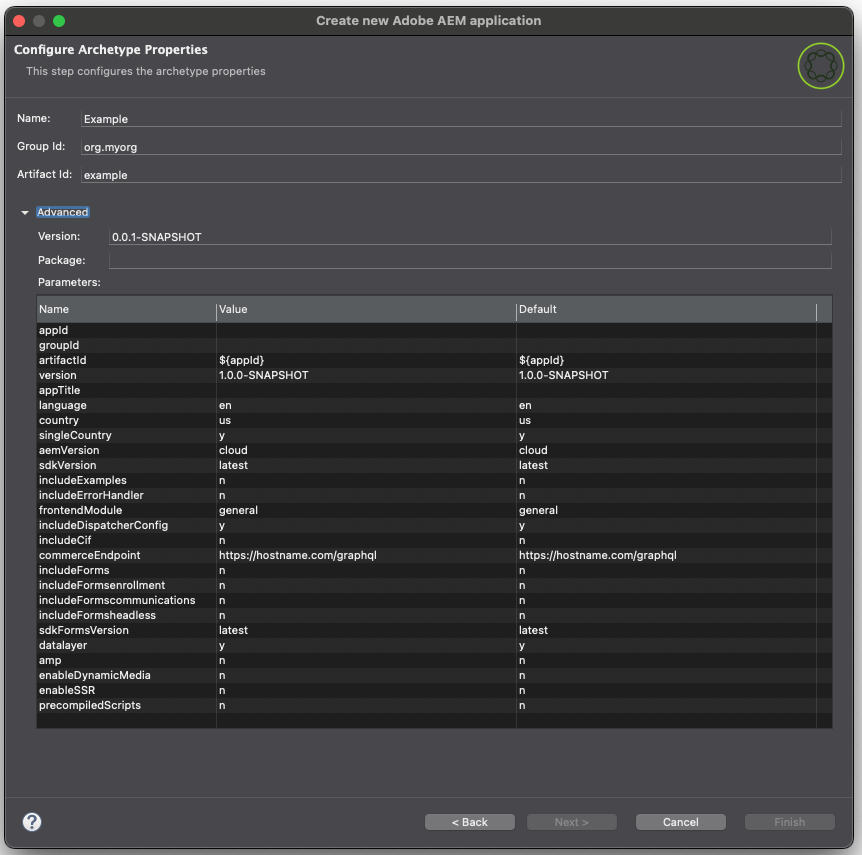
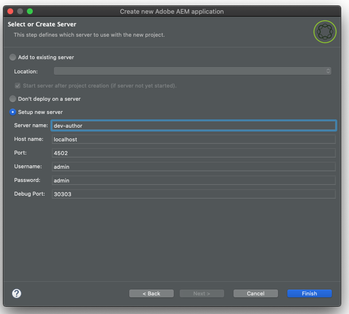

# AEM Developer Tools for Eclipse {#aem-developer-tools-for-eclipse}


## 概要 {#overview}

_Experience Manager Developer Tools for Eclipse_ は、Apache License 2 に従ってリリースされた [Apache Sling 向け Eclipse プラグイン](https://sling.apache.org/documentation/development/ide-tooling.html)をベースとした Eclipse プラグインです。

このツールは、AEM 開発を容易にする次のような機能を提供します。

* Eclipse Server Connector による AEM インスタンスとのシームレスな統合
* コンテンツと OSGi バンドルの同期
* コードのホットスワップ機能を備えたデバッグサポート
* 固有のプロジェクト作成ウィザードからの AEM プロジェクトの簡単なブートストラップ
* JCR プロパティを容易に編集できる

## 要件 {#requirements}

AEM Developer Tools を使用する前に、次の作業が必要です。

* エンタープライズ JavaおよびWeb デベロッパー向け[Eclipse IDEをダウンロードしてインストールします。](https://www.eclipse.org/downloads/packages/)
  * AEM Developer Tools for Eclipseのバージョン 1.4.0は、Eclipse 2022-12 （4.26）以降と互換性があり、実行するにはJava 17以降が必要です。
* [Eclipse FAQ](https://wiki.eclipse.org/FAQ_How_do_I_increase_the_heap_size_available_to_Eclipse%3F)の説明に従って`eclipse.ini`設定ファイルを編集し、ヒープメモリが1 GB以上になるようにEclipse インストールを設定します。

>[!NOTE]
>
>MacOSで、**Eclipse.app**&#x200B;を右クリックし、**パッケージ内容を表示**&#x200B;を選択して`eclipse.ini`を見つける必要があります。

## Eclipse 用 AEM 開発者ツールのインストール方法 {#how-to-install-the-aem-developer-tools-for-eclipse}

上記の[要件](#requirements)を満たした場合、次のように開発者ツールプラグインをインストールできます。

1. [AEM Developer Tools Web サイト](https://eclipse.adobe.com/)を開きます。

1. **インストール用リンク**&#x200B;をコピーします。

   * または、インストールリンクを使用する代わりにアーカイブをダウンロードすることもできます。
   * この方法では、オフラインでのインストールは可能ですが、自動更新通知は受け取りません。

1. Eclipse で、**ヘルプ**&#x200B;メニューを開きます。
1. 「**Install New Software**」をクリックします。
1. 「**Add...**」をクリックします。
1. 「**Name**」フィールドに「`AEM Developer Tools`」と入力します。
1. 「**Location**」フィールドにインストール用 URL をコピーします。
1. 「**Add**」をクリックします。
1. 「**AEM**」プラグインと「**Sling**」プラグインの両方をオンにします。
1. 「**Next**」をクリックします。
1. **詳細をインストール** ウィンドウで、インストールするアイテムを確認し、**次へ**&#x200B;をもう一度クリックします。
1. 使用許諾契約書に同意し、「**Finish**」をクリックします。
1. 表示される&#x200B;**Trust Authorities** ダイアログで、権限/サイト `https://eclipse.adobe.com`を選択し、**Trust Selected**&#x200B;をクリックします。
1. 表示される&#x200B;**Trust Artifacts** ダイアログで、コード署名者を選択し、**Trust Selected**&#x200B;をクリックします。
1. 「**RestartNow**」をクリックして、Eclipse を再起動します。

## AEM パースペクティブ {#the-aem-perspective}

Eclipseでは、**パースペクティブ**&#x200B;によって、ウィンドウ内で使用可能なアクションとビューが決定され、Eclipseのリソースとのタスク指向のインタラクションが可能になります。 遠近法について詳しくは、[Eclipse ドキュメントを参照してください。](https://help.eclipse.org/latest/index.jsp)。

_Experience Manager Development Tools for Eclipse_&#x200B;は、AEMの視点を提供し、AEM プロジェクトとインスタンスを完全に制御できるようにします。 AEM パースペクティブを開くには：

1. Eclipse メニューバーから、**ウィンドウ**／**パースペクティブ**／**パースペクティブを開く**／**その他**&#x200B;を選択します。
1. ダイアログで「**AEM**」を選択し、「**Open**」をクリックします。



## サンプルのマルチモジュールプロジェクト {#sample-multi-module-project}

_Experience Manager Developer Tools for Eclipse_&#x200B;には、Eclipseでのプロジェクト設定を迅速に行うためのマルチモジュールプロジェクトのサンプルが付属しています。 また、[AEM プロジェクトアーキタイプ &#x200B;](https://github.com/adobe/aem-project-archetype)を活用して、いくつかのAEM機能のベストプラクティスガイドとしても役立ちます。

サンプルプロジェクトを作成する手順は次のとおりです。

1. **File**／**New**／**Project**&#x200B;メニューで、「**AEM**」セクションを参照して、「**AEM Sample Multi-Module Project**」を選択します。

   

1. 「**Next**」をクリックします。

   >[!NOTE]
   >
   >[m2eclipse](https://eclipse.dev/m2e/)がアーキタイプカタログをスキャンする必要があるため、この手順には時間がかかる場合があります。

1. `com.adobe.aem : aem-project-archetype : <highest-number>`は、**アーキタイプ** ドロップダウンで自動的に選択する必要があります。 必要に応じて、以前のバージョンを選択します。 「**次へ**」をクリックします。

   

1. サンプルプロジェクトの次のフィールドを指定します。

   * **Name**
   * **Group Id**
   * **Artifact Id**
   * **appId** - この値を設定するには、「**Advanced**」オプションを展開する必要があります。
   * **appTitle** - この値を設定するには、「**Advanced**」オプションを展開する必要があります。
   * **Package** - この値を設定するには、「**Advanced**」オプションを展開する必要があります。

   

1. 「**Next**」をクリックします。

1. 「**新しいサーバーを設定**」を選択し、サーバー名と必要な接続の詳細を指定して、Eclipseが接続するAEM サーバーを設定します。

   

   * デバッガー機能を使用するには、次のように`-agentlib` パラメーターを指定して、AEMをデバッグモードで起動する必要があります。

   ```text
   $ java -agentlib:jdwp=transport=dt_socket,server=y,suspend=n,address=*:5005 -jar aem-author-p4502.jar
   ```

   >[!TIP]
   >
   >ローカル AEM SDKで実行中のプロジェクトのデバッグについて詳しくは、[AEM SDKのリモートデバッグに関するドキュメント &#x200B;](https://experienceleague.adobe.com/ja/docs/experience-manager-learn/cloud-service/debugging/debugging-aem-sdk/remote-debugging)を参照してください。

1. 「**終了**」をクリックします。

プロジェクト構造が作成されます。 必要なアーティファクトをプロジェクトにダウンロードするには、少し時間がかかる場合があります。

>[!NOTE]
>
>新しいインストールで、またはMavenの依存関係が以前にダウンロードされていない場合、Eclipseはプロジェクトがエラーを伴って作成されたと報告することがあります。 この場合は、[無効なプロジェクト定義の解決](#resolving-invalid-project-definition)の節で説明されている手順に従います。

## 既存プロジェクトの読み込み方法 {#how-to-import-existing-projects}

**新規プロジェクト**&#x200B;機能を使用して、基本的なプロジェクト構造を作成します。

1. 次の手順に従って、[&#x200B; サンプルマルチモジュールプロジェクト、](#sample-multi-module-project)を作成します。このプロジェクトでは、基本的なプロジェクト構造を作成し、関心を健全に分離します。

   * `PROJECT.ui.apps`：`/apps` および `/etc` のコンテンツ用
   * `PROJECT.ui.content`：`/content` の作成済みコンテンツ用
   * Java バンドルの`PROJECT.core`
   * `PROJECT.it.launcher` および `PROJECT.it.tests`：統合テスト用

1. `PROJECT.ui.apps` プロジェクトの内容をパッケージの `apps` フォルダーと `etc` フォルダーに置き換えます。

   1. **Project Explorer** パネルで、`PROJECT.ui.apps` > `src` > `main` > `content` > `jcr_root` > `apps`を展開します。
   1. `apps` フォルダーを右クリックし、**表示**／**System Explorer** を選択します。
   1. そこに`apps`と`etc`個のフォルダーを削除します。
   1. 同じ場所に、コンテンツパッケージの`apps`と`etc` フォルダーを配置します。
   1. Eclipse で `PROJECT.ui.apps` プロジェクトを右クリックし、「**更新**」を選択します。

1. 続いて、`PROJECT.ui.content` に対して同じことを行い、そのコンテンツフォルダーを自分のパッケージの 1 つに置き換えます。

   1. **Project Explorer** パネルで、`PROJECT.ui.content` > `src` > `main` > `content` > `jcr_root` > `content`を展開します。
   1. 深い階層のコンテンツフォルダーを右クリックし、**表示**／**System Explorer** を選択します。
   1. そこにコンテンツフォルダーを削除します。
   1. 同じ場所に、コンテンツパッケージのコンテンツフォルダーを配置します。
   1. Eclipse で `PROJECT.ui.content` プロジェクトを右クリックし、「**更新**」を選択します。

1. コンテンツパッケージの`META-INF/vault/filter.xml` ファイルを別のテキスト/コードエディターで開いて、これらの2つのプロジェクトの`filter.xml` ファイルをコンテンツパッケージのコンテンツに対応するように更新します。

   * `filter.xml` ファイルの例を次に示します。

   ```xml
   <?xml version="1.0" encoding="UTF-8"?>
   <workspaceFilter version="1.0">
       <filter root="/apps/foo"/>
       <filter root="/apps/foundation/components/bar"/>
       <filter root="/etc/designs/foo"/>
       <filter root="/content/foo"/>
       <filter root="/content/dam/foo"/>
       <filter root="/content/usergenerated/content/foo"/>
   </workspaceFilter>
   ```

1. 2つのプロジェクトに分割されたパッケージのコンテンツについては、これらのフィルタールールを2つに分割し、2つのプロジェクトの`filter.xml` ファイルを適切に更新する必要があります。

   1. Eclipse で `PROJECT.ui.apps/src/main/content/META-INF/filter.xml` を開きます。
   1. `<workspaceFilter>` 要素の内容を、`/apps` または `/etc` で始まる、パッケージのルールに置き換えます
      * 次に例を示します。

        ```xml
        <?xml version="1.0" encoding="UTF-8"?>
        <workspaceFilter version="1.0">
           <filter root="/apps/foo"/>
           <filter root="/apps/foundation/components/bar"/>
           <filter root="/etc/designs/foo"/>
        </workspaceFilter>
        ```

   1. 次に、`PROJECT.ui.content/src/main/content/META-INF/filter.xml` を開きます。
   1. ルールを、`/content` で始まる、パッケージのルールに置き換えます。
      * 次に例を示します。

        ```xml
        <?xml version="1.0" encoding="UTF-8"?>
        <workspaceFilter version="1.0">
           <filter root="/content/foo"/>
           <filter root="/content/dam/foo"/>
           <filter root="/content/usergenerated/content/foo"/>
        </workspaceFilter>
        ```

1. すべての変更を保存してください。 これで、新しいコンテンツが AEM インスタンスに同期するようになりました。

1. **サーバー** パネルで、接続が開始されていることを確認します。開始しない場合は、接続を開始しないでください。

1. 「**削除と公開**」アイコンをクリックします。

完了したら、パッケージがインスタンスで実行されている必要があります。 保存時に、変更はすべてインスタンスに自動的に同期されます。

プロジェクトからパッケージを再ビルドする場合は、`PROJECT.ui.apps` または `PROJECT.ui.content` を右クリックし、**次として実行**／**Maven インストール**&#x200B;を選択します。

これで、パッケージ（例えば、`PROJECT.ui.apps-0.0.1-SNAPSHOT.zip`）を含んだターゲットフォルダーが作成されました。

## トラブルシューティング {#troubleshooting}

### 無効なプロジェクト定義の解決 {#resolving-invalid-project-definition}

無効な依存関係およびプロジェクト定義を解決するには、次の手順を実行します。

1. 作成したプロジェクトをすべて選択します。
1. 右クリックします。
1. コンテキストメニューで、**Maven**／**プロジェクトを更新**&#x200B;を選択します。
1. 「**Force Updates of Snapshot/Releases**」をオンにします。
1. 「**OK**」をクリックします。

必要な依存関係が自動的にダウンロードされます。 これには少し時間がかかる場合があります。

## 詳細情報 {#more-information}

公式のApache Sling IDE ツールのEclipse web サイトには、便利な追加情報が用意されています。

* [**Apache Sling IDE tooling for Eclipse** User Guide](https://sling.apache.org/documentation/development/ide-tooling.html)では、AEM Development Toolsでサポートされている全体的なコンセプト、サーバー統合、デプロイメント機能について説明しています。
* [Apache Sling IDE ツールのトラブルシューティング](https://sling.apache.org/documentation/development/ide-tooling.html#troubleshooting)
* [既知の問題リスト](https://sling.apache.org/documentation/development/ide-tooling.html#known-issues)

次の公式の [Eclipse](https://www.eclipse.org/) ドキュメントは、環境の設定に役立ちます。

* [Eclipseの概要](https://eclipseide.org/getting-started/)
* [Eclipse Luna ヘルプシステム](https://help.eclipse.org/latest/index.jsp)
* [Maven統合（m2eclipse）](https://www.eclipse.org/m2e/)
