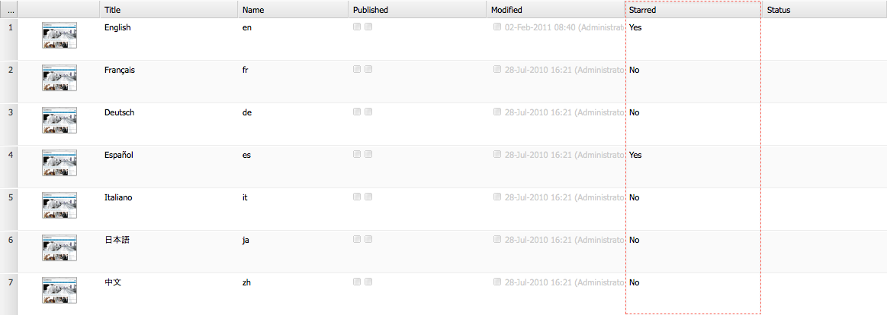

# Web サイトコンソールのカスタマイズ（クラシック UI）{#customizing-the-websites-console-classic-ui}

## Web サイト（siteadmin）コンソールにカスタム列を追加 {#adding-a-custom-column-to-the-websites-siteadmin-console}

カスタム列を表示するように web サイト管理コンソールを拡張できます。このコンソールは JSON オブジェクトをベースに構築されており、これを拡張するには `ListInfoProvider` インターフェイスを実装する OSGI サービスを作成します。こうしたサービスが、コンソール構築のためにクライアントに送信される JSON オブジェクトを修正します。

このステップバイステップのチュートリアルでは、`ListInfoProvider` インターフェイスを実装して web サイト管理コンソールに新しい列を表示する方法について説明します。主な手順は以下のとおりです。

1. [OSGI サービスを作成](#creating-the-osgi-service)し、それを含むバンドルを AEM サーバーにデプロイします。
1. （オプション）コンソールの構築に使用される JSON オブジェクトをリクエストする JSON 呼び出しを発行して、[新しいサービスをテスト](#testing-the-new-service)します。
1. リポジトリ内のコンソールのノード構造を拡張して、[新しい列を表示](#displaying-the-new-column)します。

>[!NOTE]
>
>このチュートリアルは、次の管理コンソールを拡張する場合にも使用できます。
>
>* デジタルアセットコンソール
>* コミュニティコンソール
>

### OSGI サービスの作成 {#creating-the-osgi-service}

`ListInfoProvider` インターフェイスは、次の 2 つのメソッドを定義します。

* リストのグローバルプロパティを更新する `updateListGlobalInfo`
* 単一のリスト項目を更新する `updateListItemInfo`

どちらのメソッドにも次の引数があります。

* `request`：関連付けられた Sling HTTP リクエストオブジェクト
* `info`：更新する JSON オブジェクト。グローバルリストまたは現在のリスト項目に 1 つずつ
* `resource`：Sling リソース

実装例は以下の通りです。

* 各項目に *starred* プロパティを追加します。これは、ページ名が「*e*」で始まる場合は `true` で、それ以外は `false` です。

* *starredCount* プロパティを追加します。このプロパティはリストに対してグローバルで、星印の付いたリスト項目の数が格納されます。

OSGI サービスを作成するには：

1. CRXDE Lite で、[バンドルを作成](/help/sites-developing/developing-with-crxde-lite.md#managing-a-bundle)します。
1. 以下のサンプルコードを追加します。
1. バンドルをビルドします。

新しいサービスが起動し、実行されます。

```java
package com.test;

import com.day.cq.commons.ListInfoProvider;
import com.day.cq.i18n.I18n;
import com.day.cq.wcm.api.Page;
import org.apache.felix.scr.annotations.Component;
import org.apache.felix.scr.annotations.Service;
import org.apache.sling.api.SlingHttpServletRequest;
import org.apache.sling.api.resource.Resource;
import org.apache.sling.commons.json.JSONException;
import org.apache.sling.commons.json.JSONObject;

@Component(metatype = false)
@Service(value = ListInfoProvider.class)
public class StarredListInfoProvider implements ListInfoProvider {

    private int count = 0;

    public void updateListGlobalInfo(SlingHttpServletRequest request, JSONObject info, Resource resource) throws JSONException {
        info.put("starredCount", count);
        count = 0; // reset for next execution
    }

    public void updateListItemInfo(SlingHttpServletRequest request, JSONObject info, Resource resource) throws JSONException {
        Page page = resource.adaptTo(Page.class);
        if (page != null) {
            // Consider starred if page name starts with 'e'
            boolean starred = page.getName().startsWith("e");
            if (starred) {
                count++;
            }
            I18n i18n = new I18n(request);
            info.put("starred", starred ? i18n.get("Yes") : i18n.get("No"));
        }
    }

}
```

>[!CAUTION]
>
>* 指定されたリクエストやリソースに基づいて、情報を JSON オブジェクトに追加すべきかどうかを実装環境に応じて判断する必要があります。
>* `ListInfoProvider` の実装が、応答オブジェクト内に存在するプロパティを定義している場合、そのプロパティの値は、指定した値で上書きされます。
>
>  [サービスランキング](https://www.osgi.org/javadoc/r2/org/osgi/framework/Constants.html#SERVICE_RANKING)を使用して、複数の `ListInfoProvider` 実装の実行順序を管理できます。

### 新しいサービスのテスト {#testing-the-new-service}

Web サイト管理コンソールを開いてサイトを閲覧すると、ブラウザーがコンソールの構築に使用されている JSON オブジェクトを取得するための Ajax 呼び出しを発行します。例えば、`/content/geometrixx` フォルダーを閲覧すると、コンソールを構築するために、次のリクエストが AEM サーバーに送信されます。

[https://localhost:4502/content/geometrixx.pages.json?start=0&amp;limit=30&amp;predicate=siteadmin](https://localhost:4502/content/geometrixx.pages.json?start=0&amp;limit=30&amp;predicate=siteadmin)

新しいサービスを含むバンドルのデプロイ後に、そのサービスが実行されていることを確認するには、以下を行います。

1. ブラウザーで次の URL を参照します。
   [https://localhost:4502/content/geometrixx.pages.json?start=0&amp;limit=30&amp;predicate=siteadmin](https://localhost:4502/content/geometrixx.pages.json?start=0&amp;limit=30&amp;predicate=siteadmin)

1. 応答があり、新しいプロパティが次のように表示されます。


### 新しい列の表示 {#displaying-the-new-column}

最後の手順では、`/libs/wcm/core/content/siteadmin` のオーバーレイによってすべての Geometrixx ページで新しいプロパティを表示するよう、web サイト管理コンソールのノード構造を適応させます。以下の手順を実行します。

1. CRXDE Lite で、タイプ `sling:Folder` のノードを使用してノード構造 `/apps/wcm/core/content` を作成し、構造 `/libs/wcm/core/content` を反映します。

1. ノード `/libs/wcm/core/content/siteadmin` をコピーし、以下 `/apps/wcm/core/content` に貼り付けます。

1. ノード `/apps/wcm/core/content/siteadmin/grid/assets` から `/apps/wcm/core/content/siteadmin/grid/geometrixx` にコピーし、プロパティを変更します。

   * **pageText** を削除

   * **pathRegex** を `/content/geometrixx(/.*)?` に設定
これによりすべての Geometrixx web サイトに対してグリッド設定がアクティブになります。

   * **storeProxySuffix** を `.pages.json` に設定

   * 複数値プロパティ **storeReaderFields** を編集し、`starred` 値を追加します。

   * MSM 機能をアクティベートするには、次の MSM パラメーターを複数文字列プロパティ **storeReaderFields** に追加します。

      * **msm:isSource**
      * **msm:isInBlueprint**
      * **msm:isLiveCopy**

1. （タイプ **nt:unstructured** の）`starred` ノードを、次のプロパティを設定して `/apps/wcm/core/content/siteadmin/grid/geometrixx/columns` の下に追加します。

   * **dataIndex**：文字列タイプの `starred`

   * **ヘッダー**：文字列タイプの `Starred`

   * **xtype**：文字列タイプの `gridcolumn`

1. （オプション）表示したくない列を `/apps/wcm/core/content/siteadmin/grid/geometrixx/columns` でドロップします。

1. `/siteadmin` は、デフォルトとして `/libs/wcm/core/content/siteadmin` を指すバニティーパスです。
このパスを `/apps/wcm/core/content/siteadmin` のサイト管理のバージョンにリダイレクトするには、プロパティ `sling:vanityOrder` が `/libs/wcm/core/content/siteadmin` で定義されているより大きい値を持つように定義します。デフォルト値は 300 なので、それより大きい値が適しています。

1. Web サイト管理コンソールに移動し、次の Geometrixx サイトに移動します。 
   [https://localhost:4502/siteadmin#/content/geometrixx](https://localhost:4502/siteadmin#/content/geometrixx)。

1. **Starred** という新しい列が使用可能になり、次のようにカスタム情報が表示されます。



>[!CAUTION]
>
>**pathRegex** プロパティによって定義されるリクエストパスに複数のグリッド設定が一致する場合は、最も詳しい設定ではなく、最初の設定が使用されます。つまり、設定の順序が重要です。

### サンプルパッケージ {#sample-package}

このチュートリアルの結果は、Package Share の [Web サイト管理コンソールのカスタマイズ](https://localhost:4502/crx/packageshare/index.html/content/marketplace/marketplaceProxy.html?packagePath=/content/companies/public/adobe/packages/helper/customizing-siteadmin)で入手できます。
