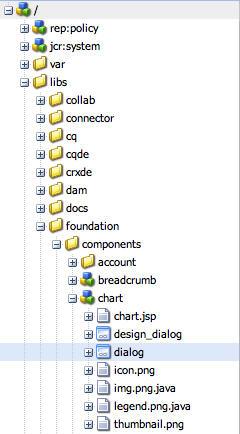
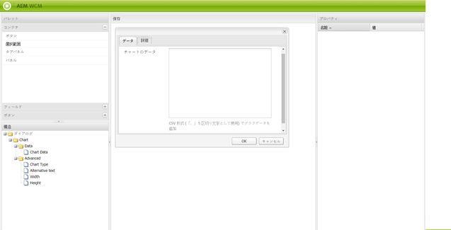

# ダイアログエディター{#dialog-editor}

ダイアログエディターは、ダイアログボックスおよび基礎モードを簡単に作成および編集できるグラフィカルインターフェイスを提供します。

機能を確認するには、CRXDE Lite に移動して、エクスプローラーツリーを `/libs/foundation/components/chart` で開き、ノード `dialog` をダブルクリックします。

dialog ノードが&#x200B;**ダイアログエディター**&#x200B;で開きます。

## ユーザーインターフェイスの概要 {#user-interface-overview}

ダイアログエディターのインターフェイスは、次の 4 つのウィンドウで構成されます。

* **パレット**&#x200B;は左上隅に表示されます。 このウィンドウには、タブパネル、テキストフィールド、選択リスト、ボタンなど、ダイアログボックスの作成に使用できるウィジェットが備わっています。 目的の区切りバーをクリックして、パレット内の様々なカテゴリを展開できます。
* **構造**&#x200B;ウィンドウは左下隅に表示されます。 このウィンドウには、ダイアログ定義を構成するノードの階層構造が表示されます。 同じ構造を表示するには、CRXDE Lite または CRX Content Explorer で dialog ノードを展開します。
* **レンダリング**&#x200B;ウィンドウは、中央に表示されます。 このウィンドウには、構造ウィンドウで定義したダイアログ定義を実際のダイアログボックスとしてレンダリングする方法が表示されます。
* **プロパティ**&#x200B;ウィンドウ。 このウィンドウには、構造ウィンドウで強調表示されたノードのプロパティが表示されます。

### ダイアログエディターの使用 {#using-the-dialog-editor}

ダイアログボックスを作成するには、パレットから構造ウィンドウに要素をドラッグ＆ドロップし、ダイアログ定義階層内に配置します。

必要な構造が完了したら、レンダリングウィンドウの上部で「**保存**」をクリックします。

>[!CAUTION]
>
>ダイアログエディターは、シンプルなダイアログを作成するためのものです。 より複雑なダイアログ定義を編集できない可能性があります。 ダイアログエディターでダイアログ構造の編集が許可されていない場合は、ダイアログ定義を手動で作成、編集またはその両方を行う必要があります。 例えば、CRXDE Lite や CRX Content Explorer を使用してノード構造を直接編集します。

### 新しいダイアログの作成 {#creating-a-new-dialog}

ダイアログボックスを作成するには、必要なコンポーネントを選択し、「**作成**」、「**ダイアログを作成**」の順にクリックします。

必要な詳細を入力して「**すべて保存**」をクリックします。ここでダイアログをダブルクリックすると、エディターで開くことができます。

### ダイアログエディターを使用した基礎モードの作成 {#using-the-dialog-editor-for-scaffolds}

基礎モードとは、1 回の手順で入力および送信できるフォームを含む特別なページです。 これにより、入力したコンテンツを使用してページをすばやく作成できます。

基礎モードを構成するフォームは、通常のダイアログと同様に、ダイアログ定義によって定義されますが、基礎モード ページには別のフォームで表示されます。 ダイアログ定義は基礎モードを定義するために使用されるため、基礎モードはダイアログエディターを使用して設計できます。 この方法でダイアログエディターを使用する場合、レンダリングウィンドウには、ダイアログ定義が基礎モードとして表示されず、ダイアログボックスの形式で表示されます。
