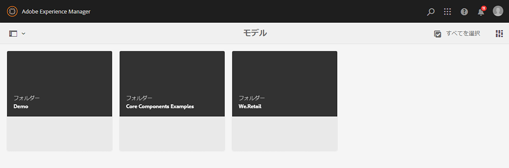
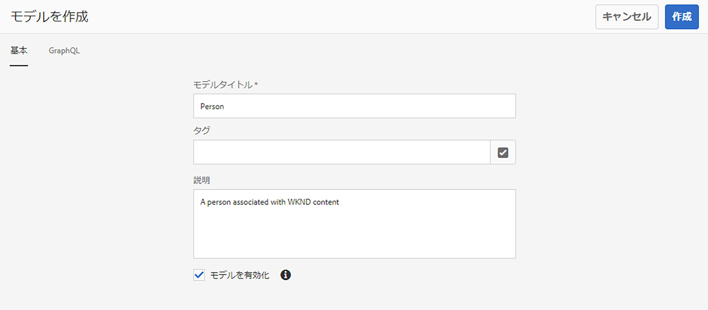
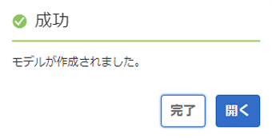
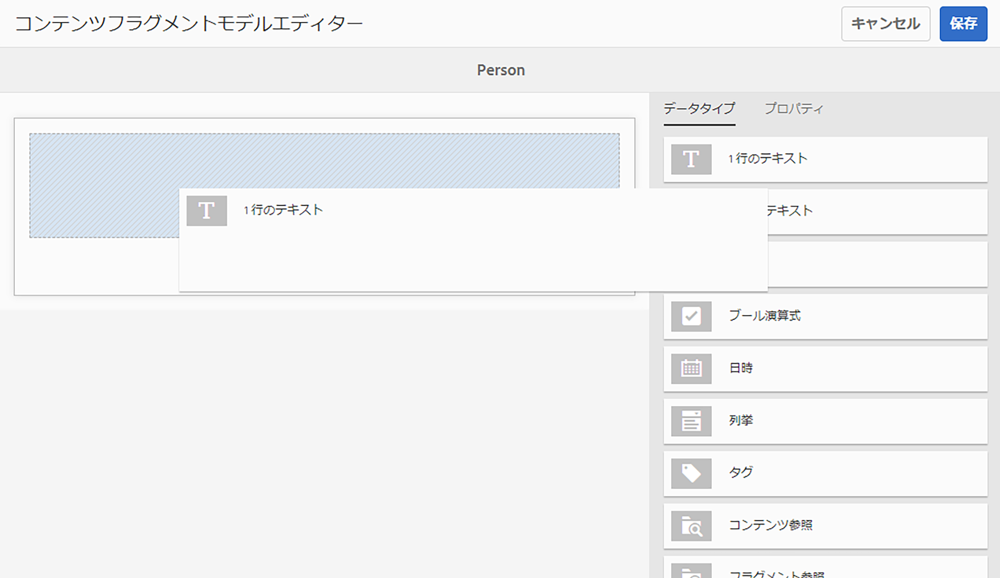
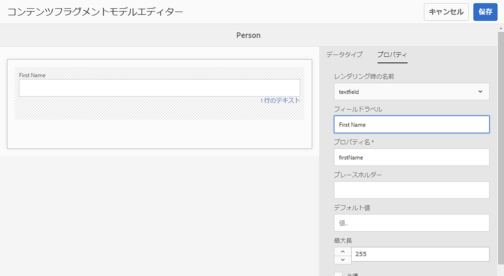
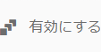
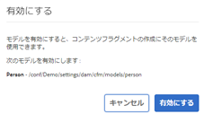
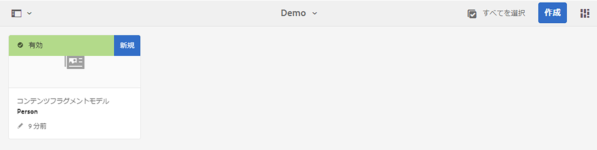

# コンテンツフラグメントモデルのヘッドレス作成のクイックスタートガイド {#creating-content-fragment-models}

コンテンツフラグメントモデルを使用して、Adobe Experience Manager（AEM）のヘッドレス機能を使用して作成および提供するコンテンツの構造を定義します。

## コンテンツフラグメントモデルとは {#what-are-content-fragment-models}

[設定を作成したので、](create-configuration.md)この設定を使用してコンテンツフラグメントモデルを作成できます。

コンテンツフラグメントモデルは、AEM で作成および管理するデータとコンテンツの構造を定義するもので、 コンテンツの一種の基礎として機能します。 コンテンツの作成を選択すると、作成者はあなたが定義したコンテンツフラグメントモデルから選択します。これが、コンテンツの作成のガイドとなります。

## コンテンツフラグメントモデルの作成方法 {#how-to-create-a-content-fragment-model}

情報アーキテクトは、新しいモデルが必要になると、これらのタスクを断続的に実行します。 この入門ガイドでは、1 つのモデルのみを作成します。

1. AEM にログインし、メインメニューで&#x200B;**ツール／アセット／コンテンツフラグメントモデル**&#x200B;を選択します。
1. 設定の作成で生成されたフォルダーをクリックします。

   
1. 「**作成**」をクリックします。
1. 「**モデルタイトル**」、「**タグ**」、「**説明**」を入力します。 また、「**モデルを有効化**」を選択／選択解除して、モデルを作成時にすぐに有効にするかどうかを指定することもできます。

   
1. 確認ウィンドウで、「**開く**」をクリックしてモデルを設定します。

   
1. **コンテンツフラグメントモデルエディター** を使用して、 **データタイプ** 列からフィールドをドラッグ&amp;ドロップして、コンテンツフラグメントモデルを作成します。

   

1. フィールドを配置した後、そのプロパティを設定する必要があります。 エディターは、追加されたフィールドの「**プロパティ**」タブに自動的に切り替わります。このフィールドで、必須フィールドを指定できます。

   
1. モデルの構築が完了したら、「**保存**」をクリックします。

1. 新規作成されたモデルのモードは、モデルの作成時に「**モデルを有効化**」を選択したかどうかによって異なります。
   * 選択済み - 新しいモデルは既に&#x200B;**有効**&#x200B;になっています。
   * 未選択 - 新しいモデルは&#x200B;**ドラフト**&#x200B;モードで作成されます。

1. まだ有効にしていない場合、このモデルを使用するにはモデルを&#x200B;**有効**&#x200B;にする必要があります。
   1. 作成したモデルを選択し、「**有効化**」をクリックします。

      
   1. 確認ダイアログで「**有効にする**」をタップまたはクリックして、モデルの有効化を確認します。

      
1. モデルが有効になり、使用できる状態になります。

   

**コンテンツフラグメントモデルエディター**&#x200B;は、単純なテキストフィールド、アセット参照、他のモデルへの参照、JSON データなど、様々なデータタイプをサポートしています。

モデルは複数作成できます。 モデルは他のコンテンツフラグメントを参照できます。 [設定](create-configuration.md)を使用して、モデルを整理します。

## 次の手順 {#next-steps}

モデルを作成してコンテンツフラグメントの構造を定義したので、入門ガイドの第 3 部に進み、[フラグメントを保存するフォルダーを作成](create-assets-folder.md)します。

>[!TIP]
>
>コンテンツフラグメントモデルについて詳しくは、[コンテンツフラグメントモデルのドキュメント](/help/assets/content-fragments/content-fragments-models.md)を参照してください。
