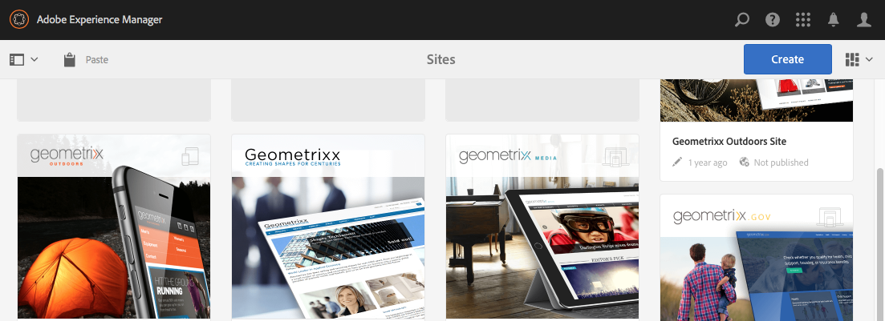

# Adobe Experience Manager タッチ操作対応 UI の構造{#structure-of-the-aem-touch-enabled-ui}

AEM タッチ操作対応 UI には、基盤となる原則があり、いくつかの主要な要素で構成されています。

## コンソール {#consoles}

### 基本レイアウトとサイズ変更 {#basic-layout-and-resizing}

UI はモバイルデバイスとデスクトップデバイスの両方に対応します。アドビでは、2 つのスタイルを作成するのではなく、すべての画面とデバイスで機能する 1 つのスタイルを使用することにしました。

すべてのモジュールで同じ基本レイアウトを使用すると、AEM では次のような表示になります。

レイアウトはレスポンシブデザインスタイルに従っており、使用するデバイスやウィンドウのサイズに収まるように自動で調整されます。

例えば、解像度が 1024 px 未満（モバイルデバイスなど）になると、それに応じて表示が調整されます。

### Header Bar {#header-bar}

ヘッダーバーにはグローバル要素が表示されます。

* ロゴおよび現在使用している特定の製品またはソリューション（AEM の場合は、グローバルナビゲーションへのリンクにもなります）
* 検索
* ヘルプリソースにアクセスするためのアイコン
* その他のソリューションにアクセスするためのアイコン
* ユーザー対応が必要なアラートまたはインボックス項目のインジケーター（またはそれらへのアクセス）
* ユーザーのプロファイル管理へのリンクになっているユーザーアイコン

### ツールバー {#toolbar}

現在の場所に応じて変わり、下のページのビューやアセットの制御に関連したツールが表示されます。ツールバーは製品固有ですが、要素には若干共通性があります。

どの場所でも、ツールバーには現在実行可能なアクションが表示されます。

また、現在リソースが選択されているかどうかによっても異なります。

### 左レール {#left-rail}

左レールは、必要に応じて表示／非表示を切り替えることができます。

* **タイムライン**
* **参照**
* **フィルター**

デフォルトは、**コンテンツのみ**&#x200B;です（パネルは非表示）。

## ページオーサリング {#page-authoring}

ページをオーサリングする場合、構造化された領域は次のようになります。

### コンテンツフレーム {#content-frame}

ページコンテンツがコンテンツフレームでレンダリングされます。コンテンツフレームはエディターから独立しており、CSS や JavaScript による競合が発生しないようにします。

コンテンツフレームは、ウィンドウの右側セクションの、ツールバーの下に表示されます。

### エディターフレーム {#editor-frame}

エディターフレームによって編集機能が実現されます。

エディターフレームは、すべてのページオーサリング要素のためのコンテナ（抽象）です。コンテンツフレームの上にあり、以下が含まれます&#x200B;*。*

* 上部のツールバー
* サイドパネル
* すべてのオーバーレイ
* その他のページオーサリング要素（コンポーネントツールバーなど）

### サイドパネル {#side-panel}

アセットとコンポーネントを選択できる 2 つのデフォルトタブが含まれています。ここからドラッグしてページにドロップできます。

サイドパネルはデフォルトでは非表示です。選択すると、左側に表示されるか、横にスライドしてウィンドウ全体を覆います（モバイルデバイスのように、ウィンドウサイズが幅 1024 px 未満の場合）。

### サイドパネル - アセット {#side-panel-assets}

「アセット」タブでは、一連のアセットから選択できます。特定の用語でフィルタリングしたり、グループを選択することもできます。

### サイドパネル - アセットグループ {#side-panel-asset-groups}

「アセット」タブにはドロップダウンがあり、特定のアセットグループを選択できます。

### サイドパネル - コンポーネント {#side-panel-components}

「コンポーネント」タブでは、一連のコンポーネントから選択できます。特定の用語でフィルタリングしたり、グループを選択することもできます。

### オーバーレイ {#overlays}

コンテンツフレームをオーバーレイし、コンポーネントおよびそのコンテンツとの（透過的な）インタラクション方法を実現するために、[レイヤー](#layer)によって使用されます。

オーバーレイは、エディターフレーム内に（他のすべてのページオーサリング要素と共に）ありますが、実際はコンテンツフレームの適切なコンポーネントにオーバーレイします。

### レイヤー {#layer}

レイヤーは、独立した機能バンドルであり、アクティベートすると次のことが可能です。

* ページを別のビューで表示
* ページの操作やインタラクションが可能

レイヤーを使用すると、個々のコンポーネントに特定のアクションが提供されるのではなく、ページ全体に高度な機能が提供されます。

AEM には、編集、プレビュー、注釈など、ページオーサリング用のレイヤーがいくつか実装済みです。

>[!NOTE]
>
>レイヤーは、ユーザーのページコンテンツの表示や操作に影響を与える強力な概念です。独自のレイヤーを開発する場合は、レイヤーを終了する際にクリーンアップするようにしてください。

### レイヤースイッチャー {#layer-switcher}

レイヤースイッチャーを使用して、使用するレイヤーを選択できます。閉じた場合は、現在使用中のレイヤーを示します。

レイヤースイッチャーは、ツールバー（ウィンドウ上部、エディターフレーム内）からドロップダウンとして使用できます。

### コンポーネントツールバー {#component-toolbar}

コンポーネントの各インスタンスは、（1 回クリックするか、ゆっくりしたダブルクリックで）クリックするとツールバーを表示します。ツールバーには、ページ上のコンポーネントインスタンス（編集可能）で使用できる特定のアクション（コピー、ペースト、エディターを開くなど）が含まれます。

表示可能なスペースによって、コンポーネントツールバーは、適切なコンポーネントの右上または右下の隅に配置されます。

## その他の情報 {#further-information}

タッチ操作対応 UI に関する概念について詳しくは、[AEM タッチ操作対応 UI の概念](/help/sites-developing/touch-ui-concepts.md)の記事を参照してください。

技術情報について詳しくは、タッチ操作対応ページエディター用の [JS ドキュメントセット](https://developer.adobe.com/experience-manager/reference-materials/6-5/jsdoc/ui-touch/editor-core/index.html)を参照してください。
