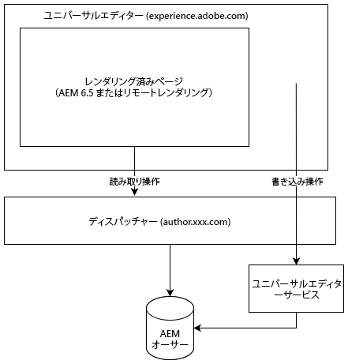

# ユニバーサルエディターについて {#universal-editor}

ユニバーサルエディターの柔軟性と、AEM 6.5 LTSを使用してヘッドレスエクスペリエンスを強化する方法について説明します。

## 概要 {#overview}

ユニバーサルエディターは、Adobe Experience Manager Sites の一部である多用途のビジュアルエディターです。 WYSIWYGを利用すれば、コンテンツ制作者は、あらゆるヘッドレスエクスペリエンスを容易に編集できます。

* 作成者は、ユニバーサルエディターの柔軟性の利点を享受できます。 AEMのヘッドレスコンテンツでも、あらゆる形式のコンテンツに同様の一貫性のあるビジュアル編集をサポートしています。
* ユニバーサルエディターは実装の真の分離もサポートしているので、開発者はユニバーサルエディターの汎用性の恩恵を受けることができます。 SDKの制約やテクノロジーの制約を受けることなく、ほぼあらゆるフレームワークやアーキテクチャを自由に選択して使用できます。

詳しくは、[ユニバーサルエディターの AEM as a Cloud Service ドキュメント](https://experienceleague.adobe.com/ja/docs/experience-manager-cloud-service/content/implementing/developing/universal-editor/introduction)を参照してください。

## アーキテクチャ {#architecture}

ユニバーサルエディターは、AEM と連携してヘッドレスでコンテンツを作成するサービスです。

* ユニバーサルエディターは`https://experience.adobe.com/#/aem/editor/canvas`でホストされ、AEM 6.5 LTSでレンダリングされたページを編集できます。
* ユニバーサルエディターは、AEM オーサーインスタンスからDispatcher経由でAEM ページを読み取ります。
* Dispatcher と同じホストで実行されるユニバーサルエディターサービスは、変更を AEM オーサーインスタンスに書き戻します。



## 要件 {#requirements}

次のオプションは、ユニバーサルエディターをサポートしています。

* AEM 6.5 LTS GA
   * オンプレミスとAdobe Managed Services（AMS）*の両方のホスティングがサポートされています。
* [AEM 6.5](https://experienceleague.adobe.com/ja/docs/experience-manager-65/content/implementing/developing/headless/universal-editor/introduction)
   * オンプレミスとAMS*の両方のホスティングがサポートされています。
* [AEM as a Cloud Service](https://experienceleague.adobe.com/ja/docs/experience-manager-cloud-service/content/implementing/developing/universal-editor/introduction) （リリース `2023.8.13099`以降）

このドキュメントでは、ユニバーサルエディターのAEM 6.5 LTS サポートに焦点を当てています。 AEM 6.5 LTSでユニバーサルエディターを使用するには、次のものが必要です。

* AEM 6.5 LTS GA
* Dispatcher が適切に設定されている

>[!NOTE]
>
>*Adobe Managed Services（AMS）をご利用の場合は、ユニバーサルエディターをご利用になりたい場合は、カスタマーサクセスエンジニア（CSE）にお問い合わせください。

## セットアップ {#setup}

ユニバーサルエディターを使用するには、次の操作を行います。

1. [AEM オーサリングインスタンスでサービスを設定します。](#configure-aem)
1. [ローカルのユニバーサルエディターサービスを設定します。](#set-up-ue)
1. [Dispatcherを調整して、ユニバーサルエディターサービスを許可します。](#update-dispatcher)

設定が完了したら、[アプリケーションを実装してユニバーサルエディターを使用](#instrumentation)できます。

### サービスの設定 {#configure-aem}

ユニバーサルエディターは、設定が必要な多数のサービスに依存しています。

#### `login-token` cookie の SameSite 属性を設定します。 {#samesite-attribute}

1. Configuration Manager を開きます。
   * `http://<host>:<port>/system/console/configMgr`
1. リストで **Adobe Granite Token Authentication Handler** を見つけて、「**設定値を変更**」をクリックします。
1. ダイアログで、**login-token cookie の SameSite 属性**（`token.samesite.cookie.attr`）の値を `Partitioned` に変更します。
1. 「**保存**」をクリックします。

#### `SAMEORIGIN` ヘッダーの X-Frame オプションを削除します。 {#sameorigin}

1. Configuration Manager を開きます。
   * `http://<host>:<port>/system/console/configMgr`
1. リストで **Apache Sling Main Servlet** を見つけて、「**設定値を編集**」をクリックします。
1. **追加の応答ヘッダー**&#x200B;属性（`sling.additional.response.headers`）から `X-Frame-Options=SAMEORIGIN` 値が存在する場合は削除します。
1. 「**保存**」をクリックします。

#### Adobe Granite クエリパラメーター認証ハンドラーの設定 {#query-parameter}

1. Configuration Manager を開きます。
   * `http://<host>:<port>/system/console/configMgr`
1. リストで **Adobe Granite Query Parameter Authentication Handler** を見つけて、「**設定値を編集**」をクリックします。
1. 「**パス**」フィールド（`path`）に、`/` を追加して有効にします。
   * 値が空の場合は、認証ハンドラーが無効になります。
1. 「**保存**」をクリックします。

#### ユニバーサルエディターで開くコンテンツパスまたは`sling:resourceTypes`を定義します {#paths}

1. Configuration Manager を開きます。
   * `http://<host>:<port>/system/console/configMgr`
1. リストで&#x200B;**ユニバーサルエディター URL サービス**&#x200B;を見つけて、「**設定値を編集**」をクリックします。
1. ユニバーサルエディターを開くコンテンツパスまたは `sling:resourceTypes` を定義します。
   * 「**ユニバーサルエディターを開くマッピング**」フィールドに、ユニバーサルエディターを開くパスを指定します。
   * ユニバーサルエディター&#x200B;**フィールドで開く** Sling:resourceTypesに、ユニバーサルエディターが直接開くリソースのリストを入力します。
1. 「**保存**」をクリックします。
1. [Externalizer設定](/help/sites-developing/externalizer.md)を確認し、少なくとも次の例のようにローカル、オーサー、パブリッシュ環境が設定されていることを確認します。

   ```text
   "local $[env:AEM_EXTERNALIZER_LOCAL;default=http://localhost:4502]",
   "author $[env:AEM_EXTERNALIZER_AUTHOR;default=http://localhost:4502]",
   "publish $[env:AEM_EXTERNALIZER_PUBLISH;default=http://localhost:4503]"
   ```

これらの設定手順が完了すると、AEMは次の順序でページのユニバーサルエディターを開きます。

1. AEMは`Universal Editor Opening Mapping`の下のマッピングをチェックし、コンテンツがそこで定義されたパスの下にある場合、ユニバーサルエディターが開きます。

1. `Universal Editor Opening Mapping`で定義されたパス以外のコンテンツの場合、AEMは、コンテンツ `resourceType`が&#x200B;**Sling:resourceTypesのエントリと一致するかどうかを確認します。このエントリは、ユニバーサルエディター**&#x200B;によって開かれます。 一致する場合、AEMはユニバーサルエディターで`${author}${path}.html`にコンテンツを開きます。
1. それ以外の場合は、AEMでページエディターが開きます。

次の変数は、`Universal Editor Opening Mapping` でマッピングを定義するために使用できます。

* `path`：開くリソースのコンテンツパス
* `localhost`: スキーマを持たない`localhost`のExternalizer エントリ （例：`localhost:4502`）
* `author`: スキーマを持たないオーサーのExternalizer エントリ （例：`localhost:4502`）
* `publish`: スキーマなしで公開するExternalizer エントリ （例：`localhost:4503`）
* `preview`: スキーマのないプレビュー用のExternalizer エントリ （例：`localhost:4504`）
* `env`：定義された Sling 実行モードに基づく `prod`、`stage`、`dev`
* `token`：`QueryTokenAuthenticationHandler` に必要なクエリトークン

マッピングの例：

* AEM オーサーの `/content/foo` の下にあるすべてのページを開きます。
   * `/content/foo:${author}${path}.html?login-token=${token}`
   * `https://localhost:4502/content/foo/x.html?login-token=<token>`を開く結果
* リモート NextJS サーバー上の `/content/bar` の下にあるすべてのページを開き、すべての変数を情報として指定します
   * `/content/bar:nextjs.server${path}?env=${env}&author=https://${author}&publish=https://${publish}&login-token=${token}`
   * `https://nextjs.server/content/bar/x?env=prod&author=https://localhost:4502&publish=https://localhost:4503&login-token=<token>`を開く結果

### ユニバーサルエディターサービスの設定 {#set-up-ue}

AEM を更新および設定すると、独自のローカル開発およびテスト用にローカルのユニバーサルエディターサービスを設定できます。

1. Node.js バージョン 20 以降をインストールします。
1. [&#x200B; ソフトウェア配布](https://experienceleague.adobe.com/ja/docs/experience-cloud/software-distribution/home)から最新のユニバーサルエディターサービスをダウンロードして解凍します
1. 環境変数または`.env` ファイルを使用してユニバーサルエディターサービスを設定します。
   * [詳しくは、AEM as a Cloud Service ユニバーサルエディターのドキュメントを参照してください。](https://experienceleague.adobe.com/ja/docs/experience-manager-cloud-service/content/implementing/developing/universal-editor/local-dev#setting-up-service)
   * 内部 IP の書き換えが必要な場合は、`UES_MAPPING` オプションを使用する必要があります。
1. `universal-editor-service.cjs` を実行します

### Dispatcher の更新 {#update-dispatcher}

AEMが設定され、ローカルのユニバーサルエディターサービスが実行されている場合は、Dispatcherで新しいサービス [のリバースプロキシを許可する必要があります。](https://experienceleague.adobe.com/ja/docs/experience-manager-dispatcher/using/dispatcher)

1. オーサーインスタンスのvhost ファイルを調整して、リバースプロキシを含めます。

   ```html
   <IfModule mod_proxy.c>
    ProxyPass "/universal-editor" "http://localhost:8080"
    ProxyPassReverse "/universal-editor" "http://localhost:8080"
   </IfModule>
   ```

   >[!NOTE]
   >
   >8080 がデフォルトのポートです。 [`.env` ファイル](https://experienceleague.adobe.com/ja/docs/experience-manager-cloud-service/content/implementing/developing/universal-editor/local-dev#setting-up-service)の `UES_PORT` パラメーターを使用して変更した場合は、ここでポート値をそれに応じて調整する必要があります。

1. Apache を再起動します。

## アプリの計測 {#instrumentation}

AEM が更新され、ローカルのユニバーサルエディターサービスが実行されている場合は、ユニバーサルエディターを使用してヘッドレスコンテンツの編集を開始できます。

ただし、ユニバーサルエディターを利用するには、アプリを実装する必要があります。 これには、コンテンツの保存方法と保存場所をエディターに指示するメタタグが含まれます。 この実装について詳しくは、[AEM as a Cloud Service のユニバーサルエディターのドキュメント](https://experienceleague.adobe.com/ja/docs/experience-manager-cloud-service/content/implementing/developing/universal-editor/getting-started#instrument-page)を参照してください。

AEM 6.5 LTSでユニバーサルエディターを使用する場合は、AEM as a Cloud Serviceでユニバーサルエディターを使用する際に次の変更が適用されることに注意してください。

* メタタグのプロトコルは、`aem` の代わりに `aem65` にする必要があります。

  ```html
  <meta name="urn:adobe:aue:system:aemconnection" content={`aem65:${getAuthorHost()}`}/>
  ```

* ユニバーサルエディターサービスのエンドポイントは、メタタグを通じて通知する必要があります。

  ```html
  <meta name="urn:adobe:aue:config:service" content={`${getAuthorHost()}/universal-editor`}/>
  ```

* コンポーネント定義の `plugins` セクションでは、`aem` の代わりに `aem65` を使用する必要があります。

>[!TIP]
>
>ユニバーサルエディターに関する包括的な開発者向けガイドについては、AEM as a Cloud Service ドキュメントの「[AEM Developers向けユニバーサルエディターの概要](https://experienceleague.adobe.com/ja/docs/experience-manager-cloud-service/content/implementing/developing/universal-editor/developer-overview)」を参照してください。 この節で説明するAEM 6.5 LTSの変更点に注意してください。

## AEM 6.5 LTSとAEM as a Cloud Serviceの違い {#differences}

AEM 6.5 LTSのユニバーサルエディターは、UIや設定の多くを含むAEM as a Cloud Serviceと同じように広く機能します。 ただし、注意すべき違いがあります。

* 6.5 LTSのユニバーサルエディターは、ヘッドレスユースケースのみをサポートしています。
* ユニバーサルエディターの設定は、6.5 LTS （[現在のドキュメントの説明](#setup)に従って）に対してわずかに異なります。
* 6.5 LTSのユニバーサルエディターでは、AEM as a Cloud Serviceとは異なるアセットピッカーとコンテンツフラグメントピッカーを使用します。
