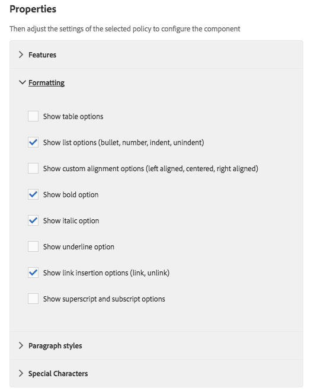

# We.Retail のコアコンポーネントを試す{#trying-out-core-components-in-we-retail}

コアコンポーネントは、柔軟性の高い最新のコンポーネントです。拡張が容易で、プロジェクトに簡単に統合できます。コアコンポーネントは、HTL、設定不要の使いやすさ、設定可能、バージョン管理、拡張性など、いくつかの重要な設計の原理に基づいて構築されています。`We.Retail` サイトは、コアコンポーネントに基づいて構築されています。

## 試してみる {#trying-it-out}

1. `We.Retail` のサンプルコンテンツでAdobe Experience Manager（AEM）を起動し、[&#x200B; コンポーネントコンソール &#x200B;](/help/sites-authoring/default-components-console.md) を開きます。

   **グローバルナビゲーション／ツール／コンポーネント**

1. コンポーネントコンソールでパネルを開くと、特定のコンポーネントグループをフィルタリングできます。コアコンポーネントは次の場所にあります。

   * `.core-wcm`：標準コアコンポーネント
   * `.core-wcm-form`：フォーム送信コアコンポーネント

   `.core-wcm` を選択します。

   

1. すべてのコアコンポーネントは、**v1** という名前を使用して各コンポーネントの最初のバージョンを示します。 通常のバージョンは今後リリースされる予定です。このバージョンはAEMとバージョン互換性があり、アップグレードが容易なので、最新機能を活用できます。
1. 「**Text (v1)**」をクリックします。

   コンポーネントの&#x200B;**リソースタイプ**&#x200B;が `/apps/core/wcm/components/text/v1/text` であることを確認します。コアコンポーネントは `/apps/core/wcm/components` の下にあり、コンポーネントごとにバージョン管理されます。

   

1. 「**ドキュメント**」タブをクリックして、コンポーネントの開発者用ドキュメントを表示します。

   

1. コンポーネントコンソールに戻ります。グループ **`We.Retail`** をフィルタリングし、「**テキスト**」コンポーネントを選択します。
1. **リソースタイプ**&#x200B;が `/apps/weretail` 下の想定したコンポーネントを指していることを確認します。ただし、**リソースのスーパータイプ**&#x200B;は元のコアコンポーネント `/apps/core/wcm/components/text/v1/text` を指しています。

   

1. 「**ライブ使用状況**」タブをクリックして、このコンポーネントが使用されているページを表示します。最初の&#x200B;**ありがとう**&#x200B;ページをクリックしてページを編集します。

   

1. ありがとうページで、テキストコンポーネントを選択し、コンポーネントの編集メニューで、継承をキャンセルアイコンをクリックします。

   [`We.Retail` はグローバル化されたサイト構造を持ち &#x200B;](/help/sites-developing/we-retail-globalized-site-structure.md) コンテンツがプライマリ言語サイトから [&#x200B; 継承と呼ばれるメカニズムを通じてライブコピー &#x200B;](/help/sites-administering/msm.md) にプッシュされます。 このため、ユーザーが手動でテキストを編集できるようにするには、継承をキャンセルする必要があります。

   

1. **はい** をクリックしてキャンセルを確定します。

   

1. 継承をキャンセルしてテキストコンポーネントを選択すると、さらに多くのオプションを使用できるようになります。「**編集**」をクリックします。

   

1. テキストコンポーネントに使用できる編集オプションが表示されます。

   

1. **ページ情報**&#x200B;メニューから「**テンプレートを編集**」を選択します。
1. ページのテンプレートエディターで、そのページの&#x200B;**レイアウトコンテナ**&#x200B;にあるテキストコンポーネントの&#x200B;**ポリシー**&#x200B;アイコンをクリックします。

   

1. コアコンポーネントを使用すれば、テンプレート作成者は、ページ作成者が使用できるプロパティを設定できます。 これらのプロパティには、許可されている貼り付け元、書式設定オプション、使用可能な段落スタイルなどの機能が含まれます。

   このようなデザインダイアログボックスは、多くのコアコンポーネントで使用でき、テンプレートエディターと連携して動作します。 有効にした機能は、コンポーネントエディターを通じて作成者に提供されます。

   

## 関連トピック {#further-information}

コアコンポーネントについて詳しくは、オーサリングガイド [&#x200B; コアコンポーネント &#x200B;](https://experienceleague.adobe.com/ja/docs/experience-manager-core-components/using/introduction) で機能の概要を参照してください。 技術的な概要については、ガイド [&#x200B; コアコンポーネントの開発 &#x200B;](https://experienceleague.adobe.com/ja/docs/experience-manager-core-components/using/developing/overview) を参照してください。

コアコンポーネントについて詳しくは、オーサリングドキュメント [&#x200B; コアコンポーネント &#x200B;](https://experienceleague.adobe.com/ja/docs/experience-manager-core-components/using/introduction) でコアコンポーネントの機能の概要を参照し、開発者用ドキュメント [&#x200B; コアコンポーネントの開発 &#x200B;](https://experienceleague.adobe.com/ja/docs/experience-manager-core-components/using/developing/overview) で技術的な詳細を参照してください。

また、[&#x200B; 編集可能テンプレート &#x200B;](/help/sites-developing/we-retail-editable-templates.md) を調査することもできます。 編集可能テンプレートについて詳しくは、オーサリングドキュメント [&#x200B; ページテンプレートの作成 &#x200B;](/help/sites-authoring/templates.md) または開発者用ドキュメントページ [&#x200B; テンプレート – 編集可能 &#x200B;](/help/sites-developing/page-templates-editable.md) を参照してください。
