# We.Retailのコアコンポーネントを試す{#trying-out-core-components-in-we-retail}

コアコンポーネントは、柔軟性の高い最新のコンポーネントです。拡張が容易で、プロジェクトに簡単に統合できます。 コアコンポーネントは、HTL、設定不要の使いやすさ、設定可能、バージョン管理、拡張性など、いくつかの重要な設計の原理に基づいて構築されています。 `We.Retail` サイトはコアコンポーネント上に構築されています。

## 体験版 {#trying-it-out}

1. `We.Retail`個のサンプルコンテンツでAdobe Experience Manager（AEM）を起動し、[ コンポーネントコンソール ](/help/sites-authoring/default-components-console.md)を開きます。

   **グローバルナビゲーション／ツール／コンポーネント**

1. コンポーネントコンソールでパネルを開くと、特定のコンポーネントグループをフィルタリングできます。 コアコンポーネントは次の場所にあります。

   * `.core-wcm`：標準コアコンポーネント
   * `.core-wcm-form`：フォーム送信コアコンポーネント

   `.core-wcm` を選択します。

   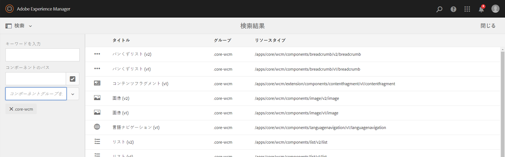

1. すべてのコアコンポーネントは、**v1**&#x200B;名を使用して、各コンポーネントの最初のバージョンを示します。 定期的なバージョンは、今後リリースされる予定です。AEMとバージョン互換性があり、簡単にアップグレードできるため、最新の機能を利用できます。
1. 「**Text (v1)**」をクリックします。

   コンポーネントの&#x200B;**リソースタイプ**&#x200B;が `/apps/core/wcm/components/text/v1/text` であることを確認します。 コアコンポーネントは `/apps/core/wcm/components` の下にあり、コンポーネントごとにバージョン管理されます。

   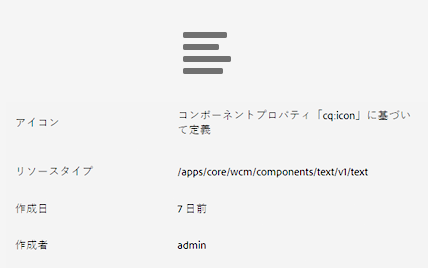

1. 「**ドキュメント**」タブをクリックして、コンポーネントの開発者用ドキュメントを表示します。

   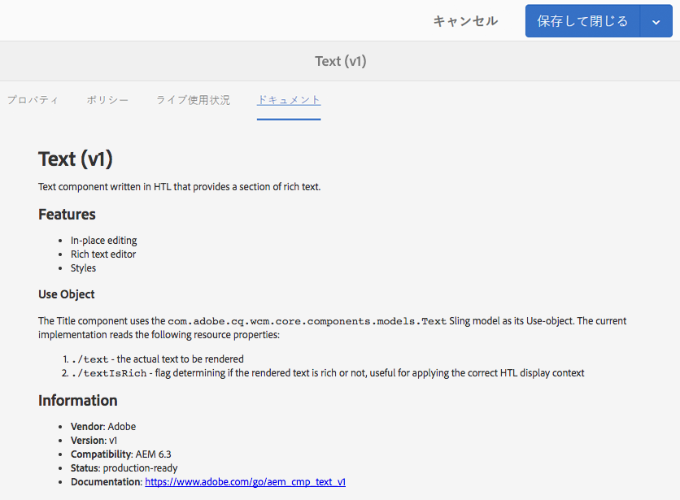

1. コンポーネントコンソールに戻ります。 グループ **`We.Retail`**&#x200B;のフィルターを実行し、**テキスト** コンポーネントを選択します。
1. **リソースタイプ**&#x200B;が `/apps/weretail` 下の想定したコンポーネントを指していることを確認します。ただし、**リソースのスーパータイプ**&#x200B;は元のコアコンポーネント `/apps/core/wcm/components/text/v1/text` を指しています。

   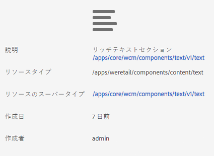

1. 「**ライブ使用状況**」タブをクリックして、このコンポーネントが使用されているページを表示します。 最初の&#x200B;**ありがとう**&#x200B;ページをクリックしてページを編集します。

   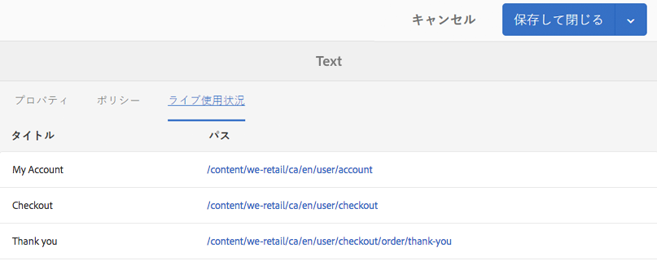

1. ありがとうページで、テキストコンポーネントを選択し、コンポーネントの編集メニューで、継承をキャンセルアイコンをクリックします。

   [`We.Retail`にはグローバル化されたサイト構造](/help/sites-developing/we-retail-globalized-site-structure.md)があり、コンテンツは継承](/help/sites-administering/msm.md)と呼ばれるメカニズムを通じて主要言語サイトから[ ライブコピーにプッシュされます。 このため、ユーザーが手動でテキストを編集できるように、継承をキャンセルする必要があります。

   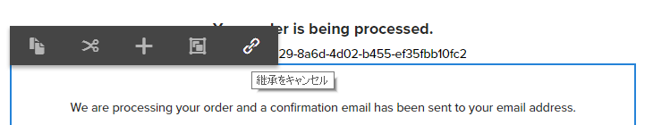

1. 「**はい**」をクリックして、解約を確定します。

   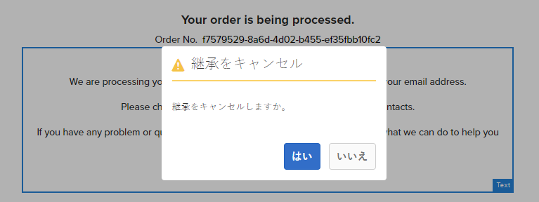

1. 継承をキャンセルしてテキストコンポーネントを選択すると、さらに多くのオプションを使用できるようになります。 「**編集**」をクリックします。

   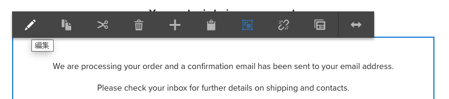

1. テキストコンポーネントに使用できる編集オプションが表示されます。

   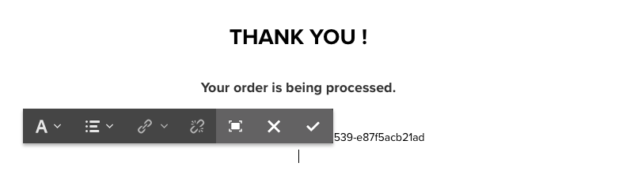

1. **ページ情報**&#x200B;メニューから「**テンプレートを編集**」を選択します。
1. ページのテンプレートエディターで、そのページの&#x200B;**レイアウトコンテナ**&#x200B;にあるテキストコンポーネントの&#x200B;**ポリシー**&#x200B;アイコンをクリックします。

   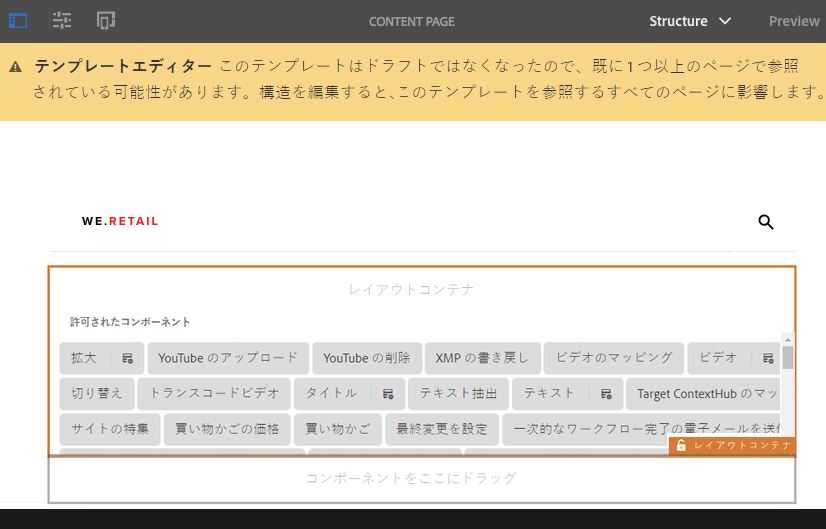

1. コアコンポーネントを使用すると、テンプレート作成者は、ページ作成者が使用できるプロパティを設定できます。 これらのプロパティには、許可されているペーストソース、書式設定オプション、使用可能な段落スタイルなどの機能が含まれます。

   このようなデザインダイアログボックスは、多くのコアコンポーネントで利用でき、テンプレートエディターと連動して動作します。 有効にした機能は、コンポーネントエディターを通じて作成者に提供されます。

   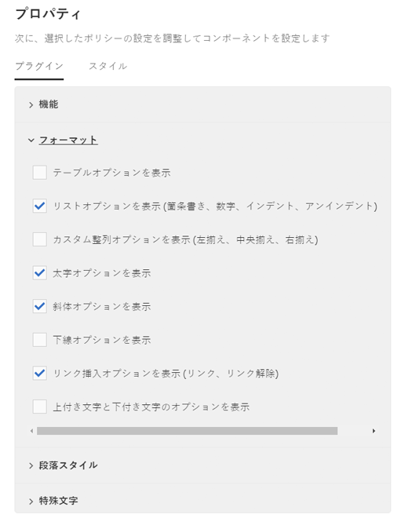

## 関連トピック {#further-information}

コアコンポーネントについて詳しくは、オーサリングガイド [ コアコンポーネント ](https://experienceleague.adobe.com/ja/docs/experience-manager-core-components/using/introduction)を参照して、機能の概要を確認してください。 技術的な概要については、ガイド [ コアコンポーネントの開発](https://experienceleague.adobe.com/en/docs/experience-manager-core-components/using/developing/overview)を参照してください。

コアコンポーネントについて詳しくは、オーサリングドキュメント [ コアコンポーネント ](https://experienceleague.adobe.com/ja/docs/experience-manager-core-components/using/introduction)でコアコンポーネント機能の概要を参照し、技術情報については開発者ドキュメント [ コアコンポーネントの開発](https://experienceleague.adobe.com/en/docs/experience-manager-core-components/using/developing/overview)を参照してください。

また、[編集可能なテンプレート ](/help/sites-developing/we-retail-editable-templates.md)を調査することもできます。 編集可能なテンプレートの詳細については、オーサリングドキュメント [ ページテンプレートの作成](/help/sites-authoring/templates.md)または開発者ドキュメント ページ [ テンプレート – 編集可能](/help/sites-developing/page-templates-editable.md)を参照してください。
