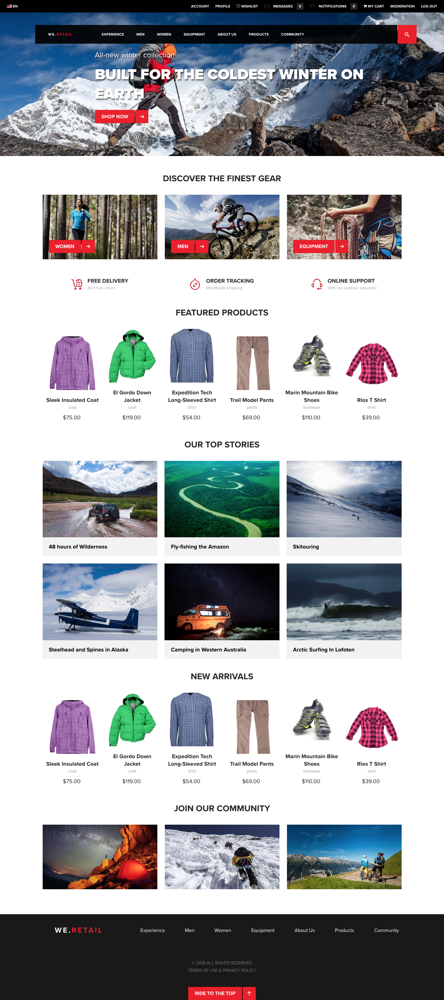

# `We.Retail`参照実装{#we-retail-reference-implementation}

## はじめに {#introduction}

`We.Retail` ページは、Adobe Experience Managerを使用してオンラインプレゼンスを設定する際に推奨される方法を示す参照実装およびサンプルコンテンツです。

`We.Retail` サイトでは、HTL、レスポンシブレイアウト、編集可能テンプレート、コアコンポーネントなど、最新のAdobe Experience Manager （AEM） テクノロジを使用しています。

これは小売業界について示していますが、サイトの設定方法は任意の業界に適用でき、商品カタログおよび買い物かご機能のみが小売特有です。

## 機能 {#features}

AEMの標準参照実装として、`We.Retail`はAEMの最も強力な機能のいくつかを紹介しています。

| **機能** | **説明** | **興味がある場合** |
|---|---|---|
| [グローバル化されたサイト構造](/help/sites-administering/tc-bp.md) | `We.Retail`には、国固有のサイトにライブコピーされる主要言語ページが含まれています。 | [試してみる](/help/sites-developing/we-retail-globalized-site-structure.md) |
| [レスポンシブレイアウト](/help/sites-authoring/responsive-layout.md) | すべてのページには、画面やデバイスのサイズに動的に適応するレスポンシブレイアウトが採用されています。 | [試してみる](/help/sites-developing/we-retail-responsive-layout.md) |
| [編集可能テンプレート](/help/sites-developing/page-templates-editable.md) | すべてのページが編集可能テンプレートに基づいており、開発者以外のユーザーがテンプレートを変更したり、カスタマイズしたりできます。 | [試してみる](/help/sites-developing/we-retail-editable-templates.md) |
| [HTML テンプレート言語](https://experienceleague.adobe.com/ja/docs/experience-manager-htl/content/overview) | すべてのコンポーネントが HTL に基づいています。 |  |
| [コアコンポーネント](https://experienceleague.adobe.com/ja/docs/experience-manager-core-components/using/introduction) | すべてのコンポーネントが新しいコアコンポーネントに基づいており、使いやすく、設定変更も手早く行えます。 | [試してみる](/help/sites-developing/we-retail-core-components.md) |
| [コンテンツフラグメント](/help/assets/content-fragments/content-fragments.md) | 「`We.Retail` エクスペリエンス」セクションでは、コンテンツフラグメントによるコンテンツの再利用の威力を紹介しています。 | [試してみる](/help/sites-developing/we-retail-content-fragments.md) |
| [エクスペリエンスフラグメント](/help/sites-authoring/experience-fragments.md) | エクスペリエンスフラグメントは、ページ内で参照できるコンテンツおよびレイアウトを含む 1 つ以上のコンポーネントのグループです。 | [試してみる](/help/sites-developing/we-retail-experience-fragments.md) |

## 今すぐ始める {#getting-started}

`We.Retail` サイトは、AEMのサンプルコンテンツとして配信されます。 使用するには、[通常どおりに AEM を起動する](/help/sites-deploying/deploy.md#getting-started)だけです。このとき、サンプルコンテンツが無効になっていないことを確認してください。

>[!CAUTION]
>
>実稼動インスタンスに`We.Retail`をインストールしないでください。 実稼動インスタンスは、`nosamplecontent` [実行モード](/help/sites-deploying/configure-runmodes.md)で開始する必要があります。

>[!CAUTION]
>
>`We.Retail` サイトは最新のAEM テクノロジに基づいているため、[&#x200B; クラシック UI オーサリング &#x200B;](/help/sites-classic-ui-authoring/classic-page-author-first-steps.md)をサポートしていません。

### 最新バージョン {#latest-version}

`We.Retail`はAEM リリースと共に配布されますが、コンテンツとその機能はリリース後に更新される場合があります。 したがって、[GitHub](https://github.com/Adobe-Marketing-Cloud/aem-sample-we-retail/releases)から最新リリースをダウンロードし、[&#x200B; アップロード &#x200B;](/help/sites-administering/package-manager.md#uploading-packages-from-your-file-system)と[&#x200B; インストール &#x200B;](/help/sites-administering/package-manager.md#installing-packages)をAEM インスタンスのパッケージとして実行できます。

### 最初のステップ {#first-steps}

1. AEMが開始されると（および/または`We.Retail`がインストールされると）、サイト **`We.Retail`**&#x200B;は[&#x200B; サイトコンソール &#x200B;](/help/sites-authoring/basic-handling.md#global-navigation)で利用できます。
1. 例えば、次のページを開くことができ、そのページは後述の[付録](#appendix)のように表示されます。

   `https://<server name>:<port number>/editor.html/content/we-retail/language-masters/en.html`

## `We.Retail`とGeometrixx {#we-retail-geometrixx}

以前のバージョンの AEM では、サンプルコンテンツとして Geometrixx とその多くの実例が提供されてきました。 バージョン 6.3以降、`We.Retail`はAEMで提供されるサンプルコンテンツであり、新しい標準参照実装として機能します。

`We.Retail` サイトは技術的に堅牢であり、最新のAEM テクノロジを活用して、より柔軟かつスケーラブルにしながら、製品の最新の機能を示します。

### 機能の比較 {#feature-comparison}

次の表では、`We.Retail`で利用できるGeometrixxと比較した主な機能の概要を示します。

* **使用可能**&#x200B;は、サンプルコンテンツに機能の例が含まれていることを意味します。
* **利用不可**&#x200B;とは、サンプルコンテンツに機能例がないことを意味しますが、機能は引き続き利用できる可能性があります。

| **機能** | **`We.Retail`** | **Geometrixx** |
|---|---|---|
| グローバル化されたサイト構造 | プライマリの言語ページを国固有のサイトにライブコピー | 使用不可 |
| コンテンツフラグメント | 使用可 | 使用不可 |
| エクスペリエンスフラグメント | 使用可 | 使用不可 |
| レスポンシブレイアウト | すべてのページ | Geometrixx Media のみ |
| 編集可能なテンプレート | すべてのページ | 使用不可 |
| HTL | すべてのコンポーネント | 限定的 |
| ターゲティング | すべてのページ | Geometrixx Outdoors のみ |
| 原稿 | 使用不可 | 使用可 |
| カルーセルビューア、ダウンロード、グラフのコンポーネント | 使用不可 | 使用可 |
| 列の制御 | レイアウトコンテナに置き換えられる | 使用可 |
| Forms | 使用不可 | 使用可 |
| Campaign | メールのサンプルはない | 使用可 |

>[!NOTE]
>
>このリストは、完全を期していますが、あらゆる機能を網羅しているわけではありません。

## コントリビューション {#contribute}

`We.Retail` サイトはオープンソース プロジェクトとしてリリースされ、最新バージョンのソースコードはGitHubからダウンロードできます。

GitHub のコード

このページのコードは GitHub にあります。

* [GitHubでaem-sample-we-retail プロジェクトを開きます](https://github.com/Adobe-Marketing-Cloud/aem-sample-we-retail)
* プロジェクトを [ZIP ファイル](https://codeload.github.com/Adobe-Marketing-Cloud/aem-sample-we-retail/zip/refs/heads/master)としてダウンロードします

最新のリリースは、インストール可能なパッケージとして[直接ダウンロード](https://github.com/Adobe-Marketing-Cloud/aem-sample-we-retail/releases/tag/we.retail.reactor-4.0.0)することもできます。

問題が発生した場合は、[GitHub の Issues](https://github.com/Adobe-Marketing-Cloud/aem-sample-we-retail/issues) に記入します。

自由にフォークするか、[プルリクエスト](https://github.com/Adobe-Marketing-Cloud/aem-sample-we-retail/pulls)によって貢献してください。

## プレビュー {#preview}

`We.Retail`のようこそページのプレビュー：

